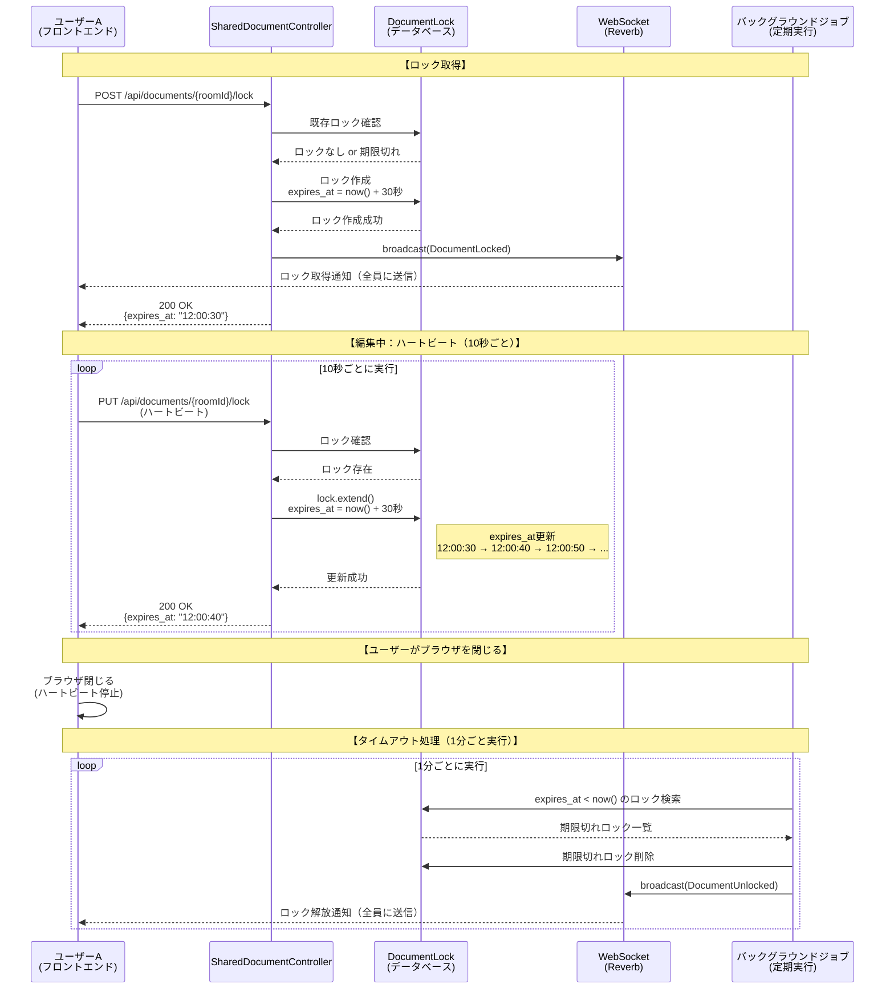
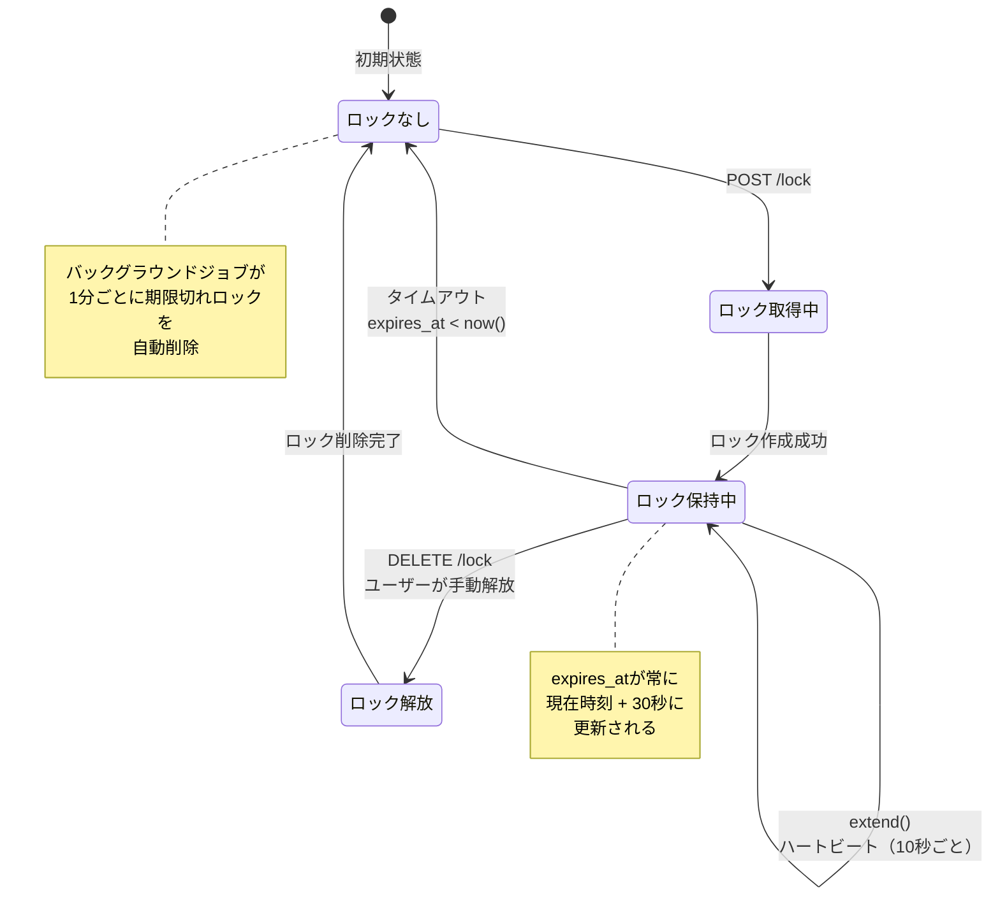
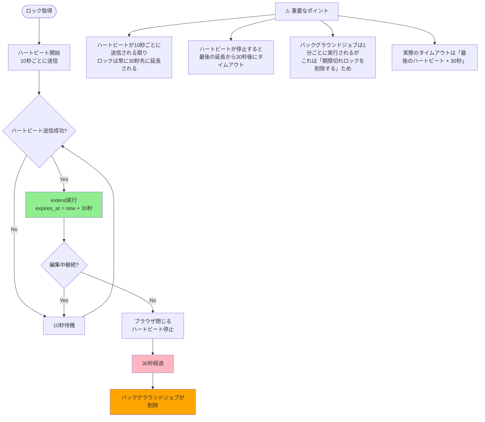

# ドキュメントロック機能の動作フロー

## 1. ロック取得からタイムアウトまでのシーケンス図



## 2. ロック有効期限のタイムライン

```mermaid
gantt
    title ロック有効期限の変化（extend()の効果）
    dateFormat HH:mm:ss
    axisFormat %H:%M

    section ロック取得
    ロック作成 (expires_at = 12:00:30) :active, lock1, 12:00:00, 30s

    section ハートビート1回目（10秒後）
    ハートビート送信 :milestone, hb1, 12:00:10, 0s
    ロック延長 (expires_at = 12:00:40) :active, lock2, 12:00:10, 30s

    section ハートビート2回目（20秒後）
    ハートビート送信 :milestone, hb2, 12:00:20, 0s
    ロック延長 (expires_at = 12:00:50) :active, lock3, 12:00:20, 30s

    section ハートビート3回目（30秒後）
    ハートビート送信 :milestone, hb3, 12:00:30, 0s
    ロック延長 (expires_at = 12:01:00) :active, lock4, 12:00:30, 30s

    section ブラウザ閉じる
    ハートビート停止 :crit, stop, 12:00:40, 0s

    section タイムアウト
    ロック自動削除 :crit, timeout, 12:01:00, 0s
```

## 3. extend()メソッドの動作フロー

```mermaid
flowchart TD
    Start([ユーザーが編集中]) --> Check{10秒経過?}
    Check -->|Yes| Send[PUT /api/documents/{roomId}/lock<br/>ハートビート送信]
    Check -->|No| Wait[待機]
    Wait --> Check
    
    Send --> Validate{ロック存在?}
    Validate -->|No| Error1[404: ロックが見つかりません]
    Validate -->|Yes| CheckOwner{自分のロック?}
    
    CheckOwner -->|No| Error2[403: ロックを保持していません]
    CheckOwner -->|Yes| Extend[lock.extend実行]
    
    Extend --> UpdateDB[expires_at = now + 30秒<br/>データベース更新]
    UpdateDB --> Success[200 OK<br/>新しいexpires_at返却]
    
    Success --> Continue[編集中継続]
    Continue --> Check
    
    Error1 --> End([エラー終了])
    Error2 --> End
    
    style Extend fill:#90EE90
    style UpdateDB fill:#87CEEB
    style Success fill:#98FB98
```

## 4. ロック状態の遷移図



## 5. 具体例：時間経過でのロック状態

```mermaid
timeline
    title ロックの有効期限変化（具体例）
    
    12:00:00 : ロック取得
             : expires_at = 12:00:30
             : ユーザーAが編集中
    
    12:00:10 : ハートビート1回目
             : extend()実行
             : expires_at = 12:00:40
    
    12:00:20 : ハートビート2回目
             : extend()実行
             : expires_at = 12:00:50
    
    12:00:30 : ハートビート3回目
             : extend()実行
             : expires_at = 12:01:00
    
    12:00:40 : ブラウザ閉じる
             : ハートビート停止
    
    12:01:00 : タイムアウト
             : expires_at < now()
             : バックグラウンドジョブが削除
             : ロック自動解放
```

## 6. 重要なポイント：実際の動作



## 7. 実際のタイムアウト時間の計算

### シナリオ1: 正常に編集中（ハートビート継続）

```
12:00:00 - ロック取得（expires_at = 12:00:30）
12:00:10 - ハートビート1（expires_at = 12:00:40）
12:00:20 - ハートビート2（expires_at = 12:00:50）
12:00:30 - ハートビート3（expires_at = 12:01:00）
...
（ハートビートが続く限り、ロックは維持される）
```

**結果**: ロックは**維持され続ける**（タイムアウトしない）

### シナリオ2: ブラウザを閉じる（ハートビート停止）

```
12:00:00 - ロック取得（expires_at = 12:00:30）
12:00:10 - ハートビート1（expires_at = 12:00:40）
12:00:20 - ハートビート2（expires_at = 12:00:50）
12:00:30 - ブラウザ閉じる（ハートビート停止）
12:00:50 - expires_at到達（タイムアウト）
12:01:00 - バックグラウンドジョブが削除（1分ごとに実行）
```

**結果**: 最後のハートビートから**約20秒後**にタイムアウト

### シナリオ3: ネットワークエラーでハートビート失敗

```
12:00:00 - ロック取得（expires_at = 12:00:30）
12:00:10 - ハートビート1成功（expires_at = 12:00:40）
12:00:20 - ハートビート2失敗（ネットワークエラー）
12:00:30 - ハートビート3失敗（ネットワークエラー）
12:00:40 - expires_at到達（タイムアウト）
12:01:00 - バックグラウンドジョブが削除
```

**結果**: 最後の成功したハートビートから**30秒後**にタイムアウト

## まとめ

### `extend()`メソッドの役割

1. **ロックの有効期限を延長**
   - `expires_at = now() + 30秒` に更新
   - 編集中は常に30秒先に有効期限を設定

2. **使用タイミング**
   - フロントエンドが10秒ごとに`PUT /api/documents/{roomId}/lock`を呼び出す
   - `updateLock()`メソッド内で`$lock->extend()`が実行される

3. **実際の動作**
   - ✅ **ハートビートが継続する限り、ロックは維持される**
   - ⚠️ **ハートビートが停止すると、最後の延長から30秒後にタイムアウト**
   - ⚠️ **バックグラウンドジョブは1分ごとに実行されるが、これは「期限切れロックを削除する」ため**
   - ⚠️ **実際のタイムアウトは「最後のハートビート + 30秒」**

4. **リアルタイム性を重視した設計**
   - 現在の実装では、ハートビートが10秒ごとに送信されるため、**実際のタイムアウトは約20秒〜30秒**
   - より短い時間に変更する場合は、`extend()`メソッドの`addSeconds(30)`を変更
   - または、設定ファイルで管理可能にする

5. **メリット**
   - ユーザーが離脱してもロックがすぐに解放される（リアルタイム性）
   - 編集中はロックが維持される
   - 自動クリーンアップでデータベースがクリーンに保たれる
   - 他のユーザーが素早く編集を開始できる
