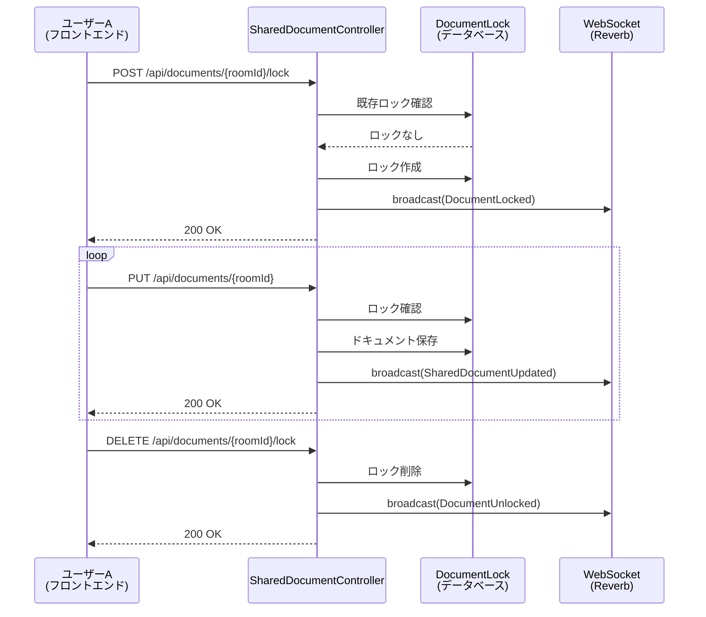

# ドキュメントロック機能の動作フロー

## ロック取得から解除までのシーケンス図

```mermaid
sequenceDiagram
    participant User as ユーザーA<br/>(フロントエンド)
    participant API as SharedDocumentController
    participant DB as DocumentLock<br/>(データベース)
    participant WS as WebSocket<br/>(Reverb)

    User->>API: POST /api/documents/{roomId}/lock
    API->>DB: 既存ロック確認
    DB-->>API: ロックなし
    API->>DB: ロック作成
    API->>WS: broadcast(DocumentLocked)
    API-->>User: 200 OK

    loop
        User->>API: PUT /api/documents/{roomId}
        API->>DB: ロック確認
        API->>DB: ドキュメント保存
        API->>WS: broadcast(SharedDocumentUpdated)
        API-->>User: 200 OK
    end

    User->>API: DELETE /api/documents/{roomId}/lock
    API->>DB: ロック削除
    API->>WS: broadcast(DocumentUnlocked)
    API-->>User: 200 OK
```

