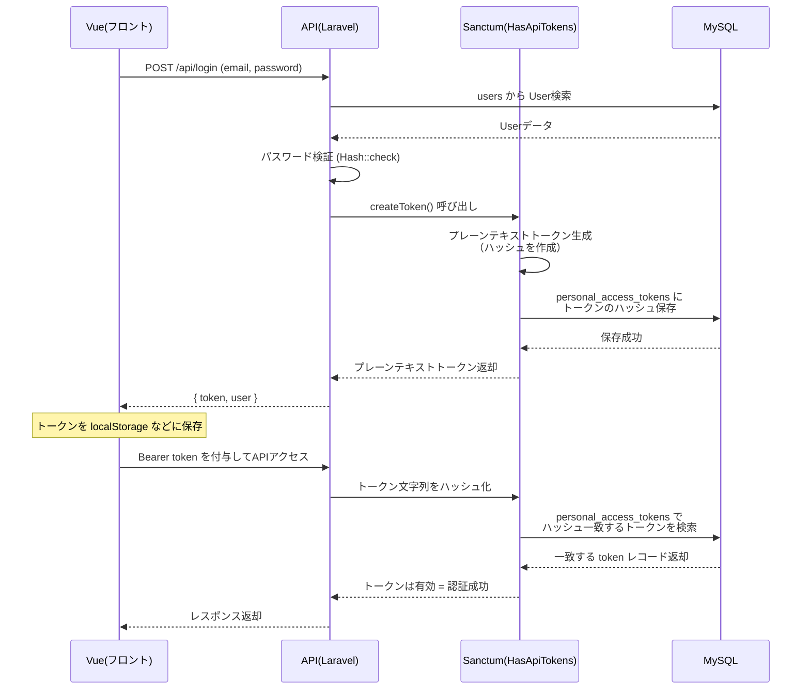
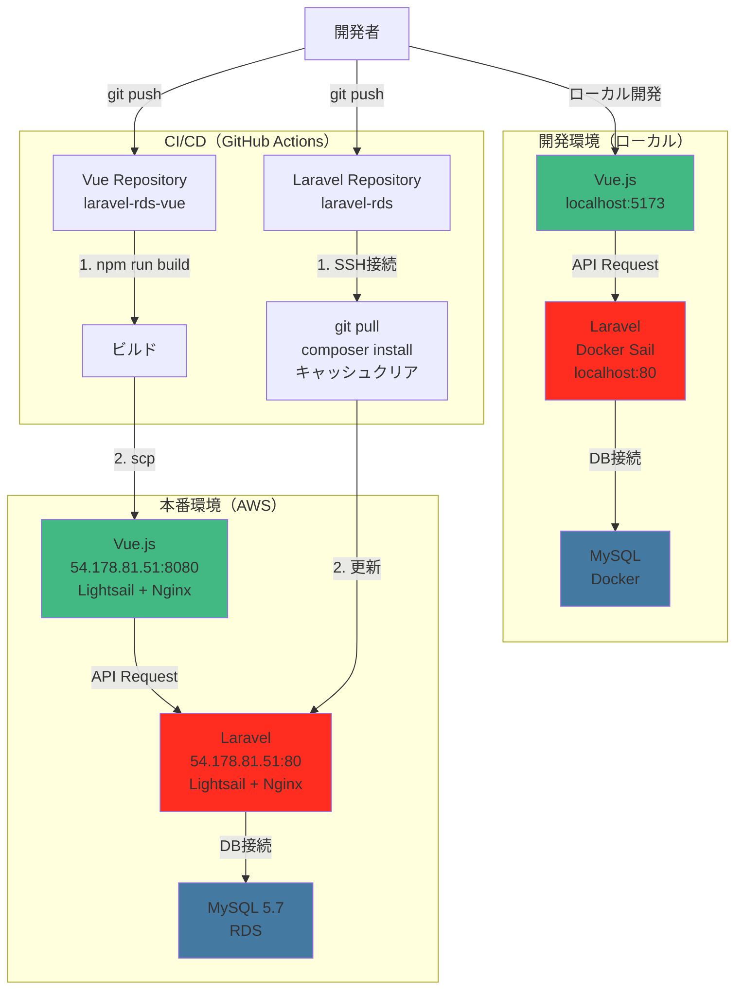
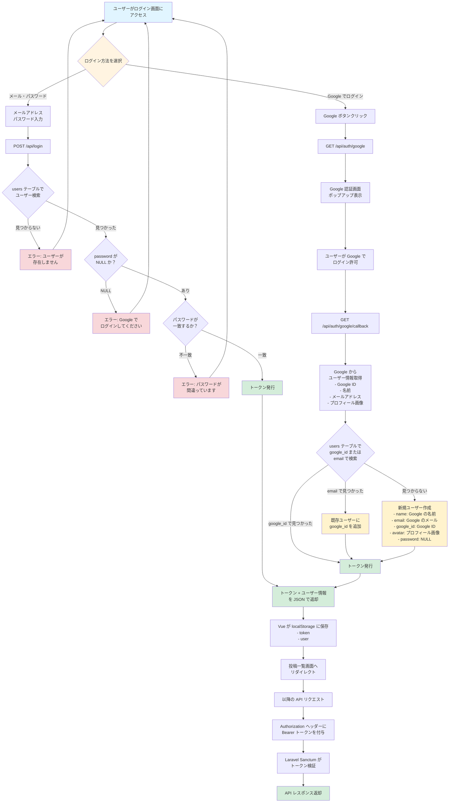

## Windows + Docker + Laravelは遅い問題

Windowsのファイル（C:ドライブ）をDockerコンテナ（Linux）がマウントすると、
ファイルアクセスのたびに変換が発生
Laravelはvendor/に数千〜数万のファイルがあり、それを頻繁に読む
この変換処理で極端に遅くなる

##  開発仕様（AI連携用プロンプト）

・Laravel API バックエンドプロジェクト
・ローカル環境 Windows 11 
  - バックエンド（API、DB）はWSL2 (Ubuntu) + Laravel Sail
    - プロジェクト配置 `/home/wida/dev/laravel-rds` (WSL2 Ubuntu内)
      Windows ファイルシステムとの変換オーバーヘッドを回避し高速化するため
  - フロントエンドはVueをnpm run devで開発サーバーを使用
・データベース接続
  - ローカル開発 Docker MySQL
  - AWS Amazon RDS (MySQL)
・デプロイ先
  - AWS Lightsail (Laravel API)
  - AWS RDS (MySQL)
  - GitHub ActionsでCI/CD自動デプロイ（mainブランチへのプッシュでトリガー）
・技術スタック: PHP 8.3、Laravel 12.x、MySQL 8.0
・リポジトリ: `git@github.com:idw-coder/laravel-rds.git`

### ユーザー認証
Sanctum とGoogoleOAuth

### CI/CD
ローカルではLaravel、MySQLはDocker Sail環境、Vueはnpm run dev で開発サーバーを使用
フロントエンド（Vue）、バックエンド（Laravel）はlightsailに
Github ActionでmainブランチプッシュをトリガーにデプロイされるようCI/CDを導入
MySQLはRDSを使用

### DB

```sql
wida@LAPTOP-2C4PL9J8:~/dev/laravel-rds$ ./vendor/bin/sail mysql bash

mysql> show tables;
+------------------------+
| Tables_in_laravel      |
+------------------------+
| cache                  |
| cache_locks            |
| failed_jobs            |
| job_batches            |
| jobs                   |
| migrations             |
| password_reset_tokens  |
| personal_access_tokens |
| posts                  |
| sessions               |
| users                  |
+------------------------+
11 rows in set (0.00 sec)

mysql> desc posts;
+------------+---------------------+------+-----+---------+----------------+
| Field      | Type                | Null | Key | Default | Extra          |
+------------+---------------------+------+-----+---------+----------------+
| id         | bigint(20) unsigned | NO   | PRI | NULL    | auto_increment |
| user_id    | bigint(20) unsigned | NO   | MUL | NULL    |                |
| title      | varchar(255)        | NO   |     | NULL    |                |
| content    | text                | NO   |     | NULL    |                |
| status     | varchar(255)        | NO   |     | draft   |                |
| created_at | timestamp           | YES  |     | NULL    |                |
| updated_at | timestamp           | YES  |     | NULL    |                |
| deleted_at | timestamp           | YES  |     | NULL    |                |
+------------+---------------------+------+-----+---------+----------------+
8 rows in set (0.00 sec)

mysql> desc users;
+-------------------+---------------------+------+-----+---------+----------------+
| Field             | Type                | Null | Key | Default | Extra          |
+-------------------+---------------------+------+-----+---------+----------------+
| id                | bigint(20) unsigned | NO   | PRI | NULL    | auto_increment |
| google_id         | varchar(255)        | YES  | UNI | NULL    |                |
| name              | varchar(255)        | NO   |     | NULL    |                |
| email             | varchar(255)        | NO   | UNI | NULL    |                |
| email_verified_at | timestamp           | YES  |     | NULL    |                |
| password          | varchar(255)        | YES  |     | NULL    |                |
| remember_token    | varchar(100)        | YES  |     | NULL    |                |
| created_at        | timestamp           | YES  |     | NULL    |                |
| updated_at        | timestamp           | YES  |     | NULL    |                |
+-------------------+---------------------+------+-----+---------+----------------+
9 rows in set (0.01 sec)

mysql> desc roles;
+------------+---------------------+------+-----+---------+----------------+
| Field      | Type                | Null | Key | Default | Extra          |
+------------+---------------------+------+-----+---------+----------------+
| id         | bigint(20) unsigned | NO   | PRI | NULL    | auto_increment |
| name       | varchar(255)        | NO   | UNI | NULL    |                |
| label      | varchar(255)        | YES  |     | NULL    |                |
| created_at | timestamp           | YES  |     | NULL    |                |
| updated_at | timestamp           | YES  |     | NULL    |                |
+------------+---------------------+------+-----+---------+----------------+
5 rows in set (0.00 sec)

```

### API ルート

```php
wida@LAPTOP-2C4PL9J8:~/dev/laravel-rds$ ./vendor/bin/sail artisan route:list
WARN[0000] The "MYSQL_EXTRA_OPTIONS" variable is not set. Defaulting to a blank string.
WARN[0000] The "MYSQL_EXTRA_OPTIONS" variable is not set. Defaulting to a blank string.

  GET|HEAD        / .................................................................................................................
  GET|HEAD        api/auth/google ......................................................... Api\GoogleAuthController@redirectToGoogle
  GET|HEAD        api/auth/google/callback ............................................ Api\GoogleAuthController@handleGoogleCallback
  POST            api/login ........................................................................ login › Api\AuthController@login
  POST            api/logout .............................................................................. Api\AuthController@logout
  GET|HEAD        api/posts .................................................................. posts.index › Api\PostController@index
  POST            api/posts .................................................................. posts.store › Api\PostController@store
  GET|HEAD        api/posts/{post} ............................................................. posts.show › Api\PostController@show
  PUT|PATCH       api/posts/{post} ......................................................... posts.update › Api\PostController@update
  DELETE          api/posts/{post} ....................................................... posts.destroy › Api\PostController@destroy
  GET|HEAD        api/profile ............................................................................... Api\UserController@show
  PUT             api/profile ............................................................................. Api\UserController@update
  GET|HEAD        api/test ..........................................................................................................
  GET|HEAD        api/user ..........................................................................................................
  GET|HEAD        sanctum/csrf-cookie ............................. sanctum.csrf-cookie › Laravel\Sanctum › CsrfCookieController@show
  GET|HEAD        storage/{path} ...................................................................................... storage.local
  GET|HEAD        up ................................................................................................................

                                                                                                                  Showing [17] routes
```

## 手順

先にディレクトリ作成してGit初期化したので別のディレクトリにインストールして、
移動しました

```bash
wida@LAPTOP-2C4PL9J8:~/dev$ curl -s "https://laravel.build/laravel-rds-temp" | bash
latest: Pulling from laravelsail/php84-composer
Digest: sha256:a2716e93e577c80bca7551126056446c1e06cb141af652ee6932537158108400
Status: Image is up to date for laravelsail/php84-composer:latest

In NewCommand.php line 789:

  Application already exists!


new [--dev] [--git] [--branch BRANCH] [--github [GITHUB]] [--organization ORGANIZATION] [--database DATABASE] [--stack [STACK]] [--breeze] [--jet] [--dark] [--typescript] [--eslint] [--ssr] [--api] [--teams] [--verification] [--pest] [--phpunit] [--prompt-breeze] [--prompt-jetstream] [-f|--force] [--] <name>

WARN[0000] The "MYSQL_EXTRA_OPTIONS" variable is not set. Defaulting to a blank string.
WARN[0000] The "MYSQL_EXTRA_OPTIONS" variable is not set. Defaulting to a blank string.
[+] Pulling 5/5
[+] Building 839.7s (21/21) FINISHED
[+] Building 1/1
 ✔ laravel.test  Built                                                                                                        0.0s

Thank you! We hope you build something incredible. Dive in with: cd laravel-rds-temp && ./vendor/bin/sail up
```

```bash
git push origin main
```

```bash
wida@LAPTOP-2C4PL9J8:~/dev/laravel-rds$ ./vendor/bin/sail up -d
```

### コンテナ起動してlocalhostにアクセスで下記エラー（1部）
```
The stream or file "/var/www/html/storage/logs/laravel.log" could not be opened in append mode: Failed to open stream: Permission denied The exception occurred while attempting to log
```
```
wida@LAPTOP-2C4PL9J8:~/dev/laravel-rds$ ls -la
total 412
drwxr-xr-x  5 wida wida   4096 Nov  5 00:00 storage
wida@LAPTOP-2C4PL9J8:~/dev/laravel-rds$ docker compose exec laravel.test bash
root@0eeea93d3466:/var/www/html# chmod -R 777 storage bootstrap/cache
root@0eeea93d3466:/var/www/html# exit
exit
wida@LAPTOP-2C4PL9J8:~/dev/laravel-rds$ ls -la
total 412
drwxrwxrwx  5 wida wida   4096 Nov  5 00:00 storage

```


### コンテナ起動してhttp://localhostにアクセスすると下記のエラー
```
SQLSTATE[42S02]: Base table or view not found: 1146 Table 'laravel.sessions' doesn't exist
```

原因はセッションテーブルがない存在しない
対応は2通り
1. セッションテーブルの作成
デフォルトでセッションテーブル用のmigrationファイルがあるので下記でOK
```php
./vendor/bin/sail artisan migrate
もしくは
docker compose exec laravel.test php artisan migrate
```
2. セッションの保存方法fileに変更する
.env
```
# SESSION_DRIVER=database
SESSION_DRIVER=file
```

### postsテーブルマイグレーションファイル作成

```bash
wida@LAPTOP-2C4PL9J8:~/dev/laravel-rds$ docker exec laravel-rds-laravel.test-1 php artisan make:migration create_posts_table

   INFO  Migration [database/migrations/2025_11_14_095149_create_posts_table.php] created successfully.
```

作成されたファイルをVSCodeで編集しようとしたら下記
```
'2025_11_14_095149_create_posts_table.php' の保存に失敗しました。
十分な権限がありません。
[管理者権限で再試行] を選択して管理者として再試行してください。
```
```bash
wida@LAPTOP-2C4PL9J8:~/dev/laravel-rds$ sudo chown wida:wida database/migrations/2025_11_14_095149_create_posts_table.php
```

で所有者を変更

マイグレーションファイル作成コマンドをSailコマンドですれば、WWWUSERになるらしいので、
次回からは`docker exec ... php artisan`は使用せず、
`./vendor/bin/sail artisan`を使用

#### マイグレーション実行

```bash
wida@LAPTOP-2C4PL9J8:~/dev/laravel-rds$ ./vendor/bin/sail artisan migrate
WARN[0000] The "MYSQL_EXTRA_OPTIONS" variable is not set. Defaulting to a blank string.
WARN[0000] The "MYSQL_EXTRA_OPTIONS" variable is not set. Defaulting to a blank string.

   INFO  Running migrations.

  2025_11_14_095149_create_posts_table .......................................................................................... 48.53ms DONE
```

### posts Modelとコントローラー作成

```bash
./vendor/bin/sail artisan make:model Post
./vendor/bin/sail artisan make:controller PostController --api
WARN[0000] The "MYSQL_EXTRA_OPTIONS" variable is not set. Defaulting to a blank string.
WARN[0000] The "MYSQL_EXTRA_OPTIONS" variable is not set. Defaulting to a blank string.

   INFO  Model [app/Models/Post.php] created successfully.

WARN[0000] The "MYSQL_EXTRA_OPTIONS" variable is not set. Defaulting to a blank string.
WARN[0000] The "MYSQL_EXTRA_OPTIONS" variable is not set. Defaulting to a blank string.

   INFO  Controller [app/Http/Controllers/PostController.php] created successfully.
```

#### --api オプション

API用のコントローラーを作成
下記の一般と違いcreate()とedit()がない
APIはフォーム画面が不要なため

```
index()    // 一覧表示
create()   // 作成フォーム表示
store()    // 保存
show()     // 詳細表示
edit()     // 編集フォーム表示
update()   // 更新
destroy()  // 削除
```

Laravel 11から api.php はデフォルトで作成されなくなりました。
API ルートをインストール

```bash
wida@LAPTOP-2C4PL9J8:~/dev/laravel-rds$ ./vendor/bin/sail artisan install:api
WARN[0000] The "MYSQL_EXTRA_OPTIONS" variable is not set. Defaulting to a blank string.
WARN[0000] The "MYSQL_EXTRA_OPTIONS" variable is not set. Defaulting to a blank string.
./composer.json has been updated
Running composer update laravel/sanctum
Loading composer repositories with package information
Updating dependencies
Your requirements could not be resolved to an installable set of packages.

  Problem 1
    - laravel/framework is locked to version v12.37.0 and an update of this package was not requested.
    - laravel/framework v12.37.0 requires symfony/http-foundation ^7.2.0 -> found symfony/http-foundation[v7.2.0, ..., v7.3.7] but these were not loaded, because they are affected by security advisories. To ignore the advisories, add ("PKSA-365x-2zjk-pt47") to the audit "ignore" config. To turn the feature off entirely, you can set "block-insecure" to false in your "audit" config.
  Problem 2
    - laravel/sail is locked to version v1.47.0 and an update of this package was not requested.
    - laravel/framework v12.37.0 requires symfony/http-foundation ^7.2.0 -> found symfony/http-foundation[v7.2.0, ..., v7.3.7] but these were not loaded, because they are affected by security advisories. To ignore the advisories, add ("PKSA-365x-2zjk-pt47") to the audit "ignore" config. To turn the feature off entirely, you can set "block-insecure" to false in your "audit" config.
    - laravel/sail v1.47.0 requires illuminate/console ^9.52.16|^10.0|^11.0|^12.0 -> satisfiable by laravel/framework[v12.37.0].


Installation failed, reverting ./composer.json and ./composer.lock to their original content.

   INFO  Published API routes file.

 One new database migration has been published. Would you like to run all pending database migrations? (yes/no) [yes]:
 > yes

   INFO  Nothing to migrate.

   INFO  API scaffolding installed. Please add the [Laravel\Sanctum\HasApiTokens] trait to your User model.
```

ルートが登録されているか確認

```bash
wida@LAPTOP-2C4PL9J8:~/dev/laravel-rds$ ./vendor/bin/sail artisan route:list --path=api
WARN[0000] The "MYSQL_EXTRA_OPTIONS" variable is not set. Defaulting to a blank string.
WARN[0000] The "MYSQL_EXTRA_OPTIONS" variable is not set. Defaulting to a blank string.

  GET|HEAD        api/posts ............................................................................... posts.index › PostController@index
  POST            api/posts ............................................................................... posts.store › PostController@store
  GET|HEAD        api/posts/{post} .......................................................................... posts.show › PostController@show
  PUT|PATCH       api/posts/{post} ...................................................................... posts.update › PostController@update
  DELETE          api/posts/{post} .................................................................... posts.destroy › PostController@destroy
  GET|HEAD        api/user ...................................................................................................................

                                                                                                                            Showing [6] routes

wida@LAPTOP-2C4PL9J8:~/dev/laravel-rds$
```

### Sanctum認証

Sanctum のインストール、Sanctum の設定ファイル公開

```bash
wida@LAPTOP-2C4PL9J8:~/dev/laravel-rds$ composer require laravel/sanctum
wida@LAPTOP-2C4PL9J8:~/dev/laravel-rds$ ./vendor/bin/sail artisan vendor:publish --provider="Laravel\Sanctum\SanctumServiceProvider"
```

#### 各種ファイル設定

- .env

```
# CORS設定
CORS_ALLOWED_ORIGINS=http://localhost:5173
CORS_ALLOWED_METHODS=*
CORS_ALLOWED_HEADERS=*
CORS_SUPPORTS_CREDENTIALS=true

# Sanctum の API トークン方式を有効
SANCTUM_STATEFUL_DOMAINS=localhost:5173
SESSION_DOMAIN=localhost
```

- bootstrap\app.phpにミドルウェアを有効化するよう追記

- app\Models\User.phpにトークンが発行できるユーザーとなるよう修正

- AuthControllerを作成

```bash
./vendor/bin/sail artisan make:controller AuthController
```

- Sanctumマイグレーションを実行
```
./vendor/bin/sail artisan migrate
```

実行時に自動で personal_access_tokens テーブルが作成

```sql
mysql> desc personal_access_tokens;
+----------------+---------------------+------+-----+---------+----------------+
| Field          | Type                | Null | Key | Default | Extra          |
+----------------+---------------------+------+-----+---------+----------------+
| id             | bigint(20) unsigned | NO   | PRI | NULL    | auto_increment |
| tokenable_type | varchar(255)        | NO   | MUL | NULL    |                |
| tokenable_id   | bigint(20) unsigned | NO   |     | NULL    |                |
| name           | text                | NO   |     | NULL    |                |
| token          | varchar(64)         | NO   | UNI | NULL    |                |
| abilities      | text                | YES  |     | NULL    |                |
| last_used_at   | timestamp           | YES  |     | NULL    |                |
| expires_at     | timestamp           | YES  | MUL | NULL    |                |
| created_at     | timestamp           | YES  |     | NULL    |                |
| updated_at     | timestamp           | YES  |     | NULL    |                |
+----------------+---------------------+------+-----+---------+----------------+
10 rows in set (0.10 sec)
```

- ユーザーの登録
```
php artisan tinker
  User::create([...])
``` 

#### 認証フロー、要確認



##### **bcryptでログイン時パスワード平文をハッシュ化**


0. ユーザー新規登録時`'password' => bcrypt($validated['password']), `
入力された平文パスワード→ハッシュ化
    - ソルトの値によってハッシュ値が変わる（ランダムなソルト値が使用される）
    ソルトはハッシュ文字列に含まれるので、のちのログイン時に入力されたパスワードを同様にハッシュ化して比較は可能
    - 上記についてソルトは公開されていることになるが、パスワードを直接推測出来ないので、安全らしい
    - コストファクターはハッシュ化難易度を設定

1. `if (!Auth::attempt($request->only('email', 'password'))) {`
↓（内部的にLaravelでは）
ログイン時に入力されるemailからユーザーを検索
2. DBでemailで一致したユーザーのハッシュ化されたパスワードの
ハッシュに含まれるソルトとコストファクターを抽出
3. 同じソルトとコストファクターで入力されたパスワードをハッシュ化
4. ハッシュ化されたパスワードどうしを比較

上記のメールアドレス、パスワードのログイン時のユーザー認証についてのロジックは
**Sanctumを使用しているわけではない**

**Sanctumでしていること**
- 新規登録、ログイン時にトークン生成（`createToken()`）
- `personal_access_tokens`テーブルにトークンのハッシュを保存
- レスポンスにプレーンテキストトークンを含めて返す
- クライアントはトークンをローカルストレージに保存
- クライアントからリクエスト時に`Authorization: Bearer {token}`ヘッダーで送信
- `auth:sanctum`ミドルウェアがトークンを検証し、有効であれば認証済みユーザーとして処理
- ログアウト時に`personal_access_tokens`テーブルからトークンを削除


### CI/CD 設定

Settings → Secrets and variables → Actions
以下の Secrets を追加：

| Name | Value |
|------|-------|
| SSH_PRIVATE_KEY | Lightsailで作成したもの |
| SSH_HOST | 54.178.81.51 |
| SSH_USER | ubuntu |

.github/workflows/deploy.ymlを作成



### Google OAuth

Users テーブルにマイグレーションを作成

```bash
./vendor/bin/sail artisan make:migration add_google_fields_to_users_table
```

Google 認証用のコントローラーを作成
```bash
./vendor/bin/sail artisan make:controller Api/GoogleAuthController
```

その他関連ファイルを修正




### roles テーブルの追加

```bash
./vendor/bin/sail artisan make:migration create_roles_table
```

#### ユーザーとロールの中間テーブル（role_user）

「ユーザー × ロール」の関係を中間テーブルで管理する
https://readouble.com/laravel/10.x/ja/eloquent-relationships.html#many-to-many

```bash
./vendor/bin/sail artisan make:migration create_role_user_table
```

Seeder を作成する
```bash
./vendor/bin/sail artisan make:seeder RoleSeeder
```

それに合わせてdatabase\seeders\DatabaseSeeder.phpも修正

DatabaseSeeder.phpのrun()メソッドが実行される
```bash
./vendor/bin/sail artisan migrate:fresh --seed
```
- `migrate:fresh`: 全テーブルを削除して再作成（空の状態）
- `--seed`: DatabaseSeederを実行して初期データを投入

User.php roles() リレーション追加

app\Models\Role.phpを作成


### Laravel Debugbar 

インストール
```bash
composer require barryvdh/laravel-debugbar --dev
```

API開発ではあまり使えない？
- Debugbar UI は出ない（Vue経由のため）
- 代わりに storage/logs/debugbar/*.json を見る

### Telescope の導入

```bash
composer require laravel/telescope --dev
```

Telescope の画面を使えるようにする
```bash
php artisan telescope:install
```

実行すると、自動的に

config/telescope.php

マイグレーションファイル
などが追加されます。

そのあと続けて マイグレーションを実行
```bash
./vendor/bin/sail artisan migrate
```

http://localhost/telescopeでブラウザで確認できる

---

## プロジェクト方針と戦略策定

1.  **ポートフォリオとしての活用**
2.  **技術学習**

### コンテンツとマネタイズ
技術的な基盤は整いつつあるが、「どのようなコンテンツを載せて運用・マネタイズ（AdSense等）していくか」が未定。
一般的なブログテーマ（お菓子、金融、ゴシップなど）は以下の理由から**非推奨**と思っている

- **技術アピールにつながらない**、採用担当者に対して「なぜWordPressではなくスクラッチ開発なのか」の説得力が弱くなる。
- **競合優位性がない**、コンテンツ勝負では大手メディアや専業ブロガーに勝てず、インプレッションが得られない。またいきなり全く知らないジャンルを攻めるのは、記事作成コストが高すぎ

まずは**「自分自身がターゲットユーザー」**となるような方針にしたい

 エンジニアリングを武器にしたコンテンツ戦略
「記事の内容」だけでなく、**「機能（システム）」自体をコンテンツの一部とする**

コンビニプロテイン比較（成分・コスパでソート）、エンジニア勉強会検索など。
複雑なクエリビルダや検索ロジックの実装力をアピールできる。

技術特化 / ドッグフーディング（自社で開発した製品やサービスを、まず自社の社員が日常的に利用し、テスト・改善を行うこと）
本アプリケーションの開発・運用過程そのものをコンテンツ化する。
- **ターゲット**は「環境構築で詰まっていた過去の自分」のようなエンジニア。
- **メリット**
  - 採用担当者が最も関心を持つ「技術的課題へのアプローチ」を可視化できる。
  - エンジニア向け広告は単価（RPM）が高い傾向にあり、少ないPVでも収益化の可能性がある。

### 「ツールやサービスをプロダクトとして組み込む」

- OGP/サムネイル画像メーカー
Intervention Image ライブラリを使った画像処理
- JSON ⇔ TypeScript 型定義 変換ツール
開発中によくある「APIから返ってきたJSONデータを、TypeScriptのinterfaceに書き換えるのが面倒くさい」という悩みを解決するツールです。

プログラミング言語特化のタイピングゲーム

---


## TODO

- **ユーザー登録機能の追加**: 現在はGoogle認証でのみ自動登録されるため、メール・パスワードでの新規登録機能（`register`メソッド）を`AuthController`に追加する。これにより、Googleアカウントを持たないユーザーも登録可能になる。
- **認証方法の統一**: メール・パスワード登録とGoogle認証の両方をサポートし、ユーザーが選択できるようにする。既存ユーザーが後からGoogle認証を紐付けたり、Google認証ユーザーがパスワードを設定できるようにする。


### APIのエラーハンドリングとレスポンス形式

ルート一覧を確認
```bash
wida@LAPTOP-2C4PL9J8:~/dev/laravel-rds$ ./vendor/bin/sail artisan route:list
WARN[0001] The "MYSQL_EXTRA_OPTIONS" variable is not set. Defaulting to a blank string.
WARN[0000] The "MYSQL_EXTRA_OPTIONS" variable is not set. Defaulting to a blank string.

  GET|HEAD        / ..........................................................................................................................
  GET|HEAD        api/auth/google .................................................................. Api\GoogleAuthController@redirectToGoogle
  GET|HEAD        api/auth/google/callback ..................................................... Api\GoogleAuthController@handleGoogleCallback
  POST            api/login ................................................................................. login › Api\AuthController@login
  POST            api/logout ....................................................................................... Api\AuthController@logout
  GET|HEAD        api/posts ........................................................................... posts.index › Api\PostController@index
  POST            api/posts ........................................................................... posts.store › Api\PostController@store
  GET|HEAD        api/posts/{post} ...................................................................... posts.show › Api\PostController@show
  PUT|PATCH       api/posts/{post} .................................................................. posts.update › Api\PostController@update
  DELETE          api/posts/{post} ................................................................ posts.destroy › Api\PostController@destroy
  GET|HEAD        api/profile ........................................................................................ Api\UserController@show
  PUT             api/profile ...................................................................................... Api\UserController@update
  GET|HEAD        api/test ...................................................................................................................
  GET|HEAD        api/user ...................................................................................................................
  GET|HEAD        sanctum/csrf-cookie ...................................... sanctum.csrf-cookie › Laravel\Sanctum › CsrfCookieController@show
  GET|HEAD        storage/{path} ............................................................................................... storage.local
  GET|HEAD        up .........................................................................................................................

                                                                                                                           Showing [17] routes
```

上記について表にまとめると

<div style="font-size: 85%;">

| メソッド | URI | ルート名（識別子） | コントローラーのメソッド名 | コントローラー（クラス） |
|---------|-----|-------------------|-------------------------|----------------------|
| GET\|HEAD | / | - | - | - |
| GET\|HEAD | api/auth/google | - | redirectToGoogle | Api\GoogleAuthController |
| GET\|HEAD | api/auth/google/callback | - | handleGoogleCallback | Api\GoogleAuthController |
| POST | api/login | login | login | Api\AuthController |
| POST | api/logout | - | logout | Api\AuthController |
| GET\|HEAD | api/posts | posts.index | index | Api\PostController |
| POST | api/posts | posts.store | store | Api\PostController |
| GET\|HEAD | api/posts/{post} | posts.show | show | Api\PostController |
| PUT\|PATCH | api/posts/{post} | posts.update | update | Api\PostController |
| DELETE | api/posts/{post} | posts.destroy | destroy | Api\PostController |
| GET\|HEAD | api/profile | - | show | Api\UserController |
| PUT | api/profile | - | update | Api\UserController |
| GET\|HEAD | api/test | - | - | - |
| GET\|HEAD | api/user | - | - | - |
| GET\|HEAD | sanctum/csrf-cookie | sanctum.csrf-cookie | show | Laravel\Sanctum\CsrfCookieController |
| GET\|HEAD | storage/{path} | storage.local | - | - |
| GET\|HEAD | up | - | - | - |

</div>

