## Windows + Docker + Laravelは遅い問題

Windowsのファイル（C:ドライブ）をDockerコンテナ（Linux）がマウントすると、
ファイルアクセスのたびに変換が発生
Laravelはvendor/に数千〜数万のファイルがあり、それを頻繁に読む
この変換処理で極端に遅くなる

### 参考記事
- [「WindowsでDockerを動かしたら遅かった😥」を解決する方法をまとめました。](https://zenn.dev/conbrio/articles/fcf937c4049132)
- [Windows + WSL2 + docker + laravel を 10 倍速くする方法](https://www.aska-ltd.jp/jp/blog/197)

##  開発仕様（AI連携用プロンプト）

・Laravel API バックエンドプロジェクト
・レンタルサーバーと AWS の両方にデプロイ可能な構成
・ローカル環境: Windows 11 + WSL2 (Ubuntu) + Docker Desktop + Laravel Sail
・プロジェクト配置: `/home/wida/dev/laravel-rds` (WSL2 Ubuntu内)
・配置理由: Windows ファイルシステムとの変換オーバーヘッドを回避し高速化
・データベース接続:
  - ローカル開発: Docker MySQL
  - レンタルサーバー: レンタルサーバーの MySQL
  - AWS: Amazon RDS (MySQL)
・デプロイ先:
  - レンタルサーバー: FTP/SSH でデプロイ
  - AWS: EC2 または Elastic Beanstalk + RDS
・技術スタック: PHP 8.2+、Laravel 12.x、MySQL 8.0
・リポジトリ: `git@github.com:idw-coder/laravel-rds.git`
・ブランチ戦略: main ブランチ運用

## 構成

```
laravel-rds/
├── docs/
│   ├── setup.md           # 環境構築手順
│   ├── deployment.md      # デプロイ手順（レンタル/AWS）
│   ├── database.md        # DB接続設定
│   ├── api.md             # API仕様
│   └── troubleshooting.md # よくある問題
├── README.md              # プロジェクト概要
```

## 手順

先にディレクトリ作成してGit初期化したので別のディレクトリにインストールして、
移動しました

```bash
wida@LAPTOP-2C4PL9J8:~/dev$ curl -s "https://laravel.build/laravel-rds-temp" | bash
latest: Pulling from laravelsail/php84-composer
Digest: sha256:a2716e93e577c80bca7551126056446c1e06cb141af652ee6932537158108400
Status: Image is up to date for laravelsail/php84-composer:latest

In NewCommand.php line 789:

  Application already exists!


new [--dev] [--git] [--branch BRANCH] [--github [GITHUB]] [--organization ORGANIZATION] [--database DATABASE] [--stack [STACK]] [--breeze] [--jet] [--dark] [--typescript] [--eslint] [--ssr] [--api] [--teams] [--verification] [--pest] [--phpunit] [--prompt-breeze] [--prompt-jetstream] [-f|--force] [--] <name>

WARN[0000] The "MYSQL_EXTRA_OPTIONS" variable is not set. Defaulting to a blank string.
WARN[0000] The "MYSQL_EXTRA_OPTIONS" variable is not set. Defaulting to a blank string.
[+] Pulling 5/5
[+] Building 839.7s (21/21) FINISHED
[+] Building 1/1
 ✔ laravel.test  Built                                                                                                        0.0s

Thank you! We hope you build something incredible. Dive in with: cd laravel-rds-temp && ./vendor/bin/sail up
```

```bash
git push origin main
```

```bash
wida@LAPTOP-2C4PL9J8:~/dev/laravel-rds$ ./vendor/bin/sail up -d
```

### コンテナ起動してlocalhostにアクセスで下記エラー（1部）
```
The stream or file "/var/www/html/storage/logs/laravel.log" could not be opened in append mode: Failed to open stream: Permission denied The exception occurred while attempting to log
```
```
wida@LAPTOP-2C4PL9J8:~/dev/laravel-rds$ ls -la
total 412
drwxr-xr-x  5 wida wida   4096 Nov  5 00:00 storage
wida@LAPTOP-2C4PL9J8:~/dev/laravel-rds$ docker compose exec laravel.test bash
root@0eeea93d3466:/var/www/html# chmod -R 777 storage bootstrap/cache
root@0eeea93d3466:/var/www/html# exit
exit
wida@LAPTOP-2C4PL9J8:~/dev/laravel-rds$ ls -la
total 412
drwxrwxrwx  5 wida wida   4096 Nov  5 00:00 storage

```


### コンテナ起動してhttp://localhostにアクセスすると下記のエラー
```
SQLSTATE[42S02]: Base table or view not found: 1146 Table 'laravel.sessions' doesn't exist
```

原因はセッションテーブルがない存在しない
対応は2通り
1. セッションテーブルの作成
デフォルトでセッションテーブル用のmigrationファイルがあるので下記でOK
```php
./vendor/bin/sail artisan migrate
もしくは
docker compose exec laravel.test php artisan migrate
```
2. セッションの保存方法fileに変更する
.env
```
# SESSION_DRIVER=database
SESSION_DRIVER=file
```

### postsテーブルマイグレーションファイル作成

```bash
wida@LAPTOP-2C4PL9J8:~/dev/laravel-rds$ docker exec laravel-rds-laravel.test-1 php artisan make:migration create_posts_table

   INFO  Migration [database/migrations/2025_11_14_095149_create_posts_table.php] created successfully.
```

作成されたファイルをVSCodeで編集しようとしたら下記
```
'2025_11_14_095149_create_posts_table.php' の保存に失敗しました。
十分な権限がありません。
[管理者権限で再試行] を選択して管理者として再試行してください。
```
```bash
wida@LAPTOP-2C4PL9J8:~/dev/laravel-rds$ sudo chown wida:wida database/migrations/2025_11_14_095149_create_posts_table.php
```

で所有者を変更

マイグレーションファイル作成コマンドをSailコマンドですれば、WWWUSERになるらしいので、
次回からは`docker exec ... php artisan`は使用せず、
`./vendor/bin/sail artisan`を使用

#### マイグレーション実行

```bash
wida@LAPTOP-2C4PL9J8:~/dev/laravel-rds$ ./vendor/bin/sail artisan migrate
WARN[0000] The "MYSQL_EXTRA_OPTIONS" variable is not set. Defaulting to a blank string.
WARN[0000] The "MYSQL_EXTRA_OPTIONS" variable is not set. Defaulting to a blank string.

   INFO  Running migrations.

  2025_11_14_095149_create_posts_table .......................................................................................... 48.53ms DONE
```

### posts Modelとコントローラー作成

```bash
./vendor/bin/sail artisan make:model Post
./vendor/bin/sail artisan make:controller PostController --api
WARN[0000] The "MYSQL_EXTRA_OPTIONS" variable is not set. Defaulting to a blank string.
WARN[0000] The "MYSQL_EXTRA_OPTIONS" variable is not set. Defaulting to a blank string.

   INFO  Model [app/Models/Post.php] created successfully.

WARN[0000] The "MYSQL_EXTRA_OPTIONS" variable is not set. Defaulting to a blank string.
WARN[0000] The "MYSQL_EXTRA_OPTIONS" variable is not set. Defaulting to a blank string.

   INFO  Controller [app/Http/Controllers/PostController.php] created successfully.
```

#### --api オプション

API用のコントローラーを作成
下記の一般と違いcreate()とedit()がない
APIはフォーム画面が不要なため

```
index()    // 一覧表示
create()   // 作成フォーム表示
store()    // 保存
show()     // 詳細表示
edit()     // 編集フォーム表示
update()   // 更新
destroy()  // 削除
```

Laravel 11から api.php はデフォルトで作成されなくなりました。
API ルートをインストール

```bash
wida@LAPTOP-2C4PL9J8:~/dev/laravel-rds$ ./vendor/bin/sail artisan install:api
WARN[0000] The "MYSQL_EXTRA_OPTIONS" variable is not set. Defaulting to a blank string.
WARN[0000] The "MYSQL_EXTRA_OPTIONS" variable is not set. Defaulting to a blank string.
./composer.json has been updated
Running composer update laravel/sanctum
Loading composer repositories with package information
Updating dependencies
Your requirements could not be resolved to an installable set of packages.

  Problem 1
    - laravel/framework is locked to version v12.37.0 and an update of this package was not requested.
    - laravel/framework v12.37.0 requires symfony/http-foundation ^7.2.0 -> found symfony/http-foundation[v7.2.0, ..., v7.3.7] but these were not loaded, because they are affected by security advisories. To ignore the advisories, add ("PKSA-365x-2zjk-pt47") to the audit "ignore" config. To turn the feature off entirely, you can set "block-insecure" to false in your "audit" config.
  Problem 2
    - laravel/sail is locked to version v1.47.0 and an update of this package was not requested.
    - laravel/framework v12.37.0 requires symfony/http-foundation ^7.2.0 -> found symfony/http-foundation[v7.2.0, ..., v7.3.7] but these were not loaded, because they are affected by security advisories. To ignore the advisories, add ("PKSA-365x-2zjk-pt47") to the audit "ignore" config. To turn the feature off entirely, you can set "block-insecure" to false in your "audit" config.
    - laravel/sail v1.47.0 requires illuminate/console ^9.52.16|^10.0|^11.0|^12.0 -> satisfiable by laravel/framework[v12.37.0].


Installation failed, reverting ./composer.json and ./composer.lock to their original content.

   INFO  Published API routes file.

 One new database migration has been published. Would you like to run all pending database migrations? (yes/no) [yes]:
 > yes

   INFO  Nothing to migrate.

   INFO  API scaffolding installed. Please add the [Laravel\Sanctum\HasApiTokens] trait to your User model.
```

ルートが登録されているか確認

```bash
wida@LAPTOP-2C4PL9J8:~/dev/laravel-rds$ ./vendor/bin/sail artisan route:list --path=api
WARN[0000] The "MYSQL_EXTRA_OPTIONS" variable is not set. Defaulting to a blank string.
WARN[0000] The "MYSQL_EXTRA_OPTIONS" variable is not set. Defaulting to a blank string.

  GET|HEAD        api/posts ............................................................................... posts.index › PostController@index
  POST            api/posts ............................................................................... posts.store › PostController@store
  GET|HEAD        api/posts/{post} .......................................................................... posts.show › PostController@show
  PUT|PATCH       api/posts/{post} ...................................................................... posts.update › PostController@update
  DELETE          api/posts/{post} .................................................................... posts.destroy › PostController@destroy
  GET|HEAD        api/user ...................................................................................................................

                                                                                                                            Showing [6] routes

wida@LAPTOP-2C4PL9J8:~/dev/laravel-rds$
```

### 認証

Sanctum のインストール、Sanctum の設定ファイル公開

```bash
wida@LAPTOP-2C4PL9J8:~/dev/laravel-rds$ composer require laravel/sanctum
wida@LAPTOP-2C4PL9J8:~/dev/laravel-rds$ ./vendor/bin/sail artisan vendor:publish --provider="Laravel\Sanctum\SanctumServiceProvider"
```

#### 各種ファイル設定

- .env

```
# CORS設定
CORS_ALLOWED_ORIGINS=http://localhost:5173
CORS_ALLOWED_METHODS=*
CORS_ALLOWED_HEADERS=*
CORS_SUPPORTS_CREDENTIALS=true

# Sanctum の API トークン方式を有効
SANCTUM_STATEFUL_DOMAINS=localhost:5173
SESSION_DOMAIN=localhost
```

- bootstrap\app.phpにミドルウェアを有効化するよう追記

- app\Models\User.phpにトークンが発行できるユーザーとなるよう修正

- AuthControllerを作成

```bash
./vendor/bin/sail artisan make:controller AuthController
```

- Sanctumマイグレーションを実行
```
./vendor/bin/sail artisan migrate
```

- ユーザーの登録
```
php artisan tinker
  User::create([...])
``` 

#### 認証フロー、要確認

```mermaid
sequenceDiagram
    participant V as Vue(フロント)
    participant A as API(Laravel)
    participant S as Sanctum(HasApiTokens)
    participant DB as MySQL

    %% --- ログイン ---
    V->>A: POST /api/login (email, password)

    A->>DB: users から User検索
    DB-->>A: Userデータ

    A->>A: パスワード検証 (Hash::check)

    A->>S: createToken() 呼び出し
    S->>S: プレーンテキストトークン生成<br>（ハッシュを作成）
    S->>DB: personal_access_tokens に<br>トークンのハッシュ保存
    DB-->>S: 保存成功

    S-->>A: プレーンテキストトークン返却
    A-->>V: { token, user }

    Note over V: トークンを localStorage などに保存


    %% --- 認証が必要な API 呼び出し ---
    V->>A: Bearer token を付与してAPIアクセス

    A->>S: トークン文字列をハッシュ化
    S->>DB: personal_access_tokens で<br>ハッシュ一致するトークンを検索
    DB-->>S: 一致する token レコード返却

    S-->>A: トークンは有効 = 認証成功
    A-->>V: レスポンス返却

```



### CI/CD 設定

Settings → Secrets and variables → Actions
以下の Secrets を追加：

| Name | Value |
|------|-------|
| SSH_PRIVATE_KEY | Lightsailで作成したもの |
| SSH_HOST | 54.178.81.51 |
| SSH_USER | ubuntu |

.github/workflows/deploy.ymlを作成

```mermaid
graph TB
    subgraph "開発環境（ローカル）"
        DevVue[Vue.js<br/>localhost:5173]
        DevLaravel[Laravel<br/>Docker Sail<br/>localhost:80]
        DevMySQL[MySQL<br/>Docker]
        
        DevVue -->|API Request| DevLaravel
        DevLaravel -->|DB接続| DevMySQL
    end
    
    subgraph "本番環境（AWS）"
        ProdVue[Vue.js<br/>54.178.81.51:8080<br/>Lightsail + Nginx]
        ProdLaravel[Laravel<br/>54.178.81.51:80<br/>Lightsail + Nginx]
        ProdMySQL[MySQL 5.7<br/>RDS]
        
        ProdVue -->|API Request| ProdLaravel
        ProdLaravel -->|DB接続| ProdMySQL
    end
    
    subgraph "CI/CD（GitHub Actions）"
        VueRepo[Vue Repository<br/>laravel-rds-vue]
        LaravelRepo[Laravel Repository<br/>laravel-rds]
        
        VueRepo -->|1. npm run build| VueBuild[ビルド]
        VueBuild -->|2. scp| ProdVue
        
        LaravelRepo -->|1. SSH接続| LaravelDeploy[git pull<br/>composer install<br/>キャッシュクリア]
        LaravelDeploy -->|2. 更新| ProdLaravel
    end
    
    Dev[開発者] -->|git push| VueRepo
    Dev -->|git push| LaravelRepo
    Dev -->|ローカル開発| DevVue

    style DevVue fill:#42b883
    style DevLaravel fill:#ff2d20
    style DevMySQL fill:#4479a1
    style ProdVue fill:#42b883
    style ProdLaravel fill:#ff2d20
    style ProdMySQL fill:#4479a1
```



### Google OAuth

Users テーブルにマイグレーションを作成

```bash
./vendor/bin/sail artisan make:migration add_google_fields_to_users_table
```

Google 認証用のコントローラーを作成
```bash
./vendor/bin/sail artisan make:controller Api/GoogleAuthController
```

その他関連ファイルを修正

```mermaid
%% 認証システム全体のフロー図

graph TB
    Start[ユーザーがログイン画面にアクセス]
    
    Start --> Choice{ログイン方法を選択}
    
    %% メール・パスワードログインフロー
    Choice -->|メール・パスワード| EmailInput[メールアドレス<br/>パスワード入力]
    EmailInput --> EmailSubmit[POST /api/login]
    EmailSubmit --> CheckUser{users テーブルで<br/>ユーザー検索}
    CheckUser -->|見つからない| EmailError1[エラー: ユーザーが<br/>存在しません]
    CheckUser -->|見つかった| CheckPassword{password が<br/>NULL か？}
    CheckPassword -->|NULL| EmailError2[エラー: Google で<br/>ログインしてください]
    CheckPassword -->|あり| ValidatePassword{パスワードが<br/>一致するか？}
    ValidatePassword -->|不一致| EmailError3[エラー: パスワードが<br/>間違っています]
    ValidatePassword -->|一致| IssueToken1[トークン発行]
    
    %% Google OAuthログインフロー
    Choice -->|Google でログイン| GoogleButton[Google ボタンクリック]
    GoogleButton --> GetAuthUrl[GET /api/auth/google]
    GetAuthUrl --> GooglePopup[Google 認証画面<br/>ポップアップ表示]
    GooglePopup --> UserAuth[ユーザーが Google で<br/>ログイン許可]
    UserAuth --> GoogleCallback[GET /api/auth/google/callback]
    GoogleCallback --> GetGoogleUser[Google から<br/>ユーザー情報取得<br/>- Google ID<br/>- 名前<br/>- メールアドレス<br/>- プロフィール画像]
    GetGoogleUser --> SearchUser{users テーブルで<br/>google_id または<br/>email で検索}
    
    SearchUser -->|google_id で見つかった| IssueToken2[トークン発行]
    SearchUser -->|email で見つかった| UpdateGoogleId[既存ユーザーに<br/>google_id を追加]
    UpdateGoogleId --> IssueToken2
    SearchUser -->|見つからない| CreateUser[新規ユーザー作成<br/>- name: Google の名前<br/>- email: Google のメール<br/>- google_id: Google ID<br/>- avatar: プロフィール画像<br/>- password: NULL]
    CreateUser --> IssueToken2
    
    %% トークン発行後の共通フロー
    IssueToken1 --> ReturnToken[トークン + ユーザー情報<br/>を JSON で返却]
    IssueToken2 --> ReturnToken
    
    ReturnToken --> SaveToken[Vue が localStorage に保存<br/>- token<br/>- user]
    SaveToken --> Redirect[投稿一覧画面へ<br/>リダイレクト]
    
    %% 認証済みリクエスト
    Redirect --> AuthRequest[以降の API リクエスト]
    AuthRequest --> SendToken[Authorization ヘッダーに<br/>Bearer トークンを付与]
    SendToken --> VerifyToken[Laravel Sanctum が<br/>トークン検証]
    VerifyToken --> Success[API レスポンス返却]
    
    %% エラーハンドリング
    EmailError1 --> Start
    EmailError2 --> Start
    EmailError3 --> Start
    
    style Start fill:#e1f5ff
    style Choice fill:#fff4e1
    style IssueToken1 fill:#d4edda
    style IssueToken2 fill:#d4edda
    style ReturnToken fill:#d4edda
    style Success fill:#d4edda
    style EmailError1 fill:#f8d7da
    style EmailError2 fill:#f8d7da
    style EmailError3 fill:#f8d7da
    style CreateUser fill:#fff3cd
    style UpdateGoogleId fill:#fff3cd
```


