## Windows + Docker + Laravelは遅い問題

Windowsのファイル（C:ドライブ）をDockerコンテナ（Linux）がマウントすると、
ファイルアクセスのたびに変換が発生
Laravelはvendor/に数千〜数万のファイルがあり、それを頻繁に読む
この変換処理で極端に遅くなる

##  開発仕様（AI連携用プロンプト）

・Laravel API バックエンドプロジェクト
・ローカル環境 Windows 11 
  - バックエンド（API、DB）はWSL2 (Ubuntu) + Laravel Sail（512 MB RAM、2 vCPU、20 GB SSD）
    - プロジェクト配置 `/home/wida/dev/laravel-rds` (WSL2 Ubuntu内)
      Windows ファイルシステムとの変換オーバーヘッドを回避し高速化するため
  - フロントエンドはVueをnpm run devで開発サーバーを使用
・デプロイ先
  - AWS Lightsail (Laravel API、MySQL)
  - GitHub ActionsでCI/CD自動デプロイ（mainブランチへのプッシュでトリガー）
・技術スタック: PHP 8.3、Laravel 12.x、MySQL 8.0
・リポジトリ: `git@github.com:idw-coder/laravel-rds.git`

### ページ、機能
- 投稿記事CLUD
- タイピングゲーム
- エンジニア系YouTubeチャンネルレビューページ（途中まで）
- エンジニア書籍レビューページ（途中まで）

### ユーザー認証
Sanctum とGoogoleOAuth

### CI/CD
ローカルではLaravel、MySQLはDocker Sail環境、Vueはnpm run dev で開発サーバーを使用
フロントエンド（Vue）、バックエンド（Laravel）はlightsailに
Github ActionでmainブランチプッシュをトリガーにデプロイされるようCI/CDを導入
MySQLはRDSを使用

### DB

```sql
wida@LAPTOP-2C4PL9J8:~/dev/laravel-rds$ ./vendor/bin/sail mysql bash

mysql> show tables;
+------------------------+
| Tables_in_laravel      |
+------------------------+
| cache                  |
| cache_locks            |
| failed_jobs            |
| job_batches            |
| jobs                   |
| migrations             |
| password_reset_tokens  |
| personal_access_tokens |
| posts                  |
| sessions               |
| users                  |
+------------------------+
11 rows in set (0.00 sec)

mysql> desc posts;
+------------+---------------------+------+-----+---------+----------------+
| Field      | Type                | Null | Key | Default | Extra          |
+------------+---------------------+------+-----+---------+----------------+
| id         | bigint(20) unsigned | NO   | PRI | NULL    | auto_increment |
| user_id    | bigint(20) unsigned | NO   | MUL | NULL    |                |
| title      | varchar(255)        | NO   |     | NULL    |                |
| content    | text                | NO   |     | NULL    |                |
| status     | varchar(255)        | NO   |     | draft   |                |
| created_at | timestamp           | YES  |     | NULL    |                |
| updated_at | timestamp           | YES  |     | NULL    |                |
| deleted_at | timestamp           | YES  |     | NULL    |                |
+------------+---------------------+------+-----+---------+----------------+
8 rows in set (0.00 sec)

mysql> desc users;
+-------------------+---------------------+------+-----+---------+----------------+
| Field             | Type                | Null | Key | Default | Extra          |
+-------------------+---------------------+------+-----+---------+----------------+
| id                | bigint(20) unsigned | NO   | PRI | NULL    | auto_increment |
| google_id         | varchar(255)        | YES  | UNI | NULL    |                |
| name              | varchar(255)        | NO   |     | NULL    |                |
| email             | varchar(255)        | NO   | UNI | NULL    |                |
| email_verified_at | timestamp           | YES  |     | NULL    |                |
| password          | varchar(255)        | YES  |     | NULL    |                |
| remember_token    | varchar(100)        | YES  |     | NULL    |                |
| created_at        | timestamp           | YES  |     | NULL    |                |
| updated_at        | timestamp           | YES  |     | NULL    |                |
+-------------------+---------------------+------+-----+---------+----------------+
9 rows in set (0.01 sec)

mysql> desc roles;
+------------+---------------------+------+-----+---------+----------------+
| Field      | Type                | Null | Key | Default | Extra          |
+------------+---------------------+------+-----+---------+----------------+
| id         | bigint(20) unsigned | NO   | PRI | NULL    | auto_increment |
| name       | varchar(255)        | NO   | UNI | NULL    |                |
| label      | varchar(255)        | YES  |     | NULL    |                |
| created_at | timestamp           | YES  |     | NULL    |                |
| updated_at | timestamp           | YES  |     | NULL    |                |
+------------+---------------------+------+-----+---------+----------------+
5 rows in set (0.00 sec)

```

### API ルート

```php
wida@LAPTOP-2C4PL9J8:~/dev/laravel-rds$ ./vendor/bin/sail artisan route:list
WARN[0000] The "MYSQL_EXTRA_OPTIONS" variable is not set. Defaulting to a blank string.
WARN[0000] The "MYSQL_EXTRA_OPTIONS" variable is not set. Defaulting to a blank string.

  GET|HEAD        / .................................................................................................................
  GET|HEAD        api/auth/google ......................................................... Api\GoogleAuthController@redirectToGoogle
  GET|HEAD        api/auth/google/callback ............................................ Api\GoogleAuthController@handleGoogleCallback
  POST            api/login ........................................................................ login › Api\AuthController@login
  POST            api/logout .............................................................................. Api\AuthController@logout
  GET|HEAD        api/posts .................................................................. posts.index › Api\PostController@index
  POST            api/posts .................................................................. posts.store › Api\PostController@store
  GET|HEAD        api/posts/{post} ............................................................. posts.show › Api\PostController@show
  PUT|PATCH       api/posts/{post} ......................................................... posts.update › Api\PostController@update
  DELETE          api/posts/{post} ....................................................... posts.destroy › Api\PostController@destroy
  GET|HEAD        api/profile ............................................................................... Api\UserController@show
  PUT             api/profile ............................................................................. Api\UserController@update
  GET|HEAD        api/test ..........................................................................................................
  GET|HEAD        api/user ..........................................................................................................
  GET|HEAD        sanctum/csrf-cookie ............................. sanctum.csrf-cookie › Laravel\Sanctum › CsrfCookieController@show
  GET|HEAD        storage/{path} ...................................................................................... storage.local
  GET|HEAD        up ................................................................................................................

                                                                                                                  Showing [17] routes
```

## 手順

先にディレクトリ作成してGit初期化したので別のディレクトリにインストールして、
移動しました

```bash
wida@LAPTOP-2C4PL9J8:~/dev$ curl -s "https://laravel.build/laravel-rds-temp" | bash
latest: Pulling from laravelsail/php84-composer
Digest: sha256:a2716e93e577c80bca7551126056446c1e06cb141af652ee6932537158108400
Status: Image is up to date for laravelsail/php84-composer:latest

In NewCommand.php line 789:

  Application already exists!


new [--dev] [--git] [--branch BRANCH] [--github [GITHUB]] [--organization ORGANIZATION] [--database DATABASE] [--stack [STACK]] [--breeze] [--jet] [--dark] [--typescript] [--eslint] [--ssr] [--api] [--teams] [--verification] [--pest] [--phpunit] [--prompt-breeze] [--prompt-jetstream] [-f|--force] [--] <name>

WARN[0000] The "MYSQL_EXTRA_OPTIONS" variable is not set. Defaulting to a blank string.
WARN[0000] The "MYSQL_EXTRA_OPTIONS" variable is not set. Defaulting to a blank string.
[+] Pulling 5/5
[+] Building 839.7s (21/21) FINISHED
[+] Building 1/1
 ✔ laravel.test  Built                                                                                                        0.0s

Thank you! We hope you build something incredible. Dive in with: cd laravel-rds-temp && ./vendor/bin/sail up
```

```bash
git push origin main
```

```bash
wida@LAPTOP-2C4PL9J8:~/dev/laravel-rds$ ./vendor/bin/sail up -d
```

### コンテナ起動してlocalhostにアクセスで下記エラー（1部）
```
The stream or file "/var/www/html/storage/logs/laravel.log" could not be opened in append mode: Failed to open stream: Permission denied The exception occurred while attempting to log
```
```
wida@LAPTOP-2C4PL9J8:~/dev/laravel-rds$ ls -la
total 412
drwxr-xr-x  5 wida wida   4096 Nov  5 00:00 storage
wida@LAPTOP-2C4PL9J8:~/dev/laravel-rds$ docker compose exec laravel.test bash
root@0eeea93d3466:/var/www/html# chmod -R 777 storage bootstrap/cache
root@0eeea93d3466:/var/www/html# exit
exit
wida@LAPTOP-2C4PL9J8:~/dev/laravel-rds$ ls -la
total 412
drwxrwxrwx  5 wida wida   4096 Nov  5 00:00 storage

```


### コンテナ起動してhttp://localhostにアクセスすると下記のエラー
```
SQLSTATE[42S02]: Base table or view not found: 1146 Table 'laravel.sessions' doesn't exist
```

原因はセッションテーブルがない存在しない
対応は2通り
1. セッションテーブルの作成
デフォルトでセッションテーブル用のmigrationファイルがあるので下記でOK
```php
./vendor/bin/sail artisan migrate
もしくは
docker compose exec laravel.test php artisan migrate
```
2. セッションの保存方法fileに変更する
.env
```
# SESSION_DRIVER=database
SESSION_DRIVER=file
```

### postsテーブルマイグレーションファイル作成

```bash
wida@LAPTOP-2C4PL9J8:~/dev/laravel-rds$ docker exec laravel-rds-laravel.test-1 php artisan make:migration create_posts_table

   INFO  Migration [database/migrations/2025_11_14_095149_create_posts_table.php] created successfully.
```

作成されたファイルをVSCodeで編集しようとしたら下記
```
'2025_11_14_095149_create_posts_table.php' の保存に失敗しました。
十分な権限がありません。
[管理者権限で再試行] を選択して管理者として再試行してください。
```
```bash
wida@LAPTOP-2C4PL9J8:~/dev/laravel-rds$ sudo chown wida:wida database/migrations/2025_11_14_095149_create_posts_table.php
```

で所有者を変更

マイグレーションファイル作成コマンドをSailコマンドですれば、WWWUSERになるらしいので、
次回からは`docker exec ... php artisan`は使用せず、
`./vendor/bin/sail artisan`を使用

#### マイグレーション実行

```bash
wida@LAPTOP-2C4PL9J8:~/dev/laravel-rds$ ./vendor/bin/sail artisan migrate
WARN[0000] The "MYSQL_EXTRA_OPTIONS" variable is not set. Defaulting to a blank string.
WARN[0000] The "MYSQL_EXTRA_OPTIONS" variable is not set. Defaulting to a blank string.

   INFO  Running migrations.

  2025_11_14_095149_create_posts_table .......................................................................................... 48.53ms DONE
```

### posts Modelとコントローラー作成

```bash
./vendor/bin/sail artisan make:model Post
./vendor/bin/sail artisan make:controller PostController --api
WARN[0000] The "MYSQL_EXTRA_OPTIONS" variable is not set. Defaulting to a blank string.
WARN[0000] The "MYSQL_EXTRA_OPTIONS" variable is not set. Defaulting to a blank string.

   INFO  Model [app/Models/Post.php] created successfully.

WARN[0000] The "MYSQL_EXTRA_OPTIONS" variable is not set. Defaulting to a blank string.
WARN[0000] The "MYSQL_EXTRA_OPTIONS" variable is not set. Defaulting to a blank string.

   INFO  Controller [app/Http/Controllers/PostController.php] created successfully.
```

#### --api オプション

API用のコントローラーを作成
下記の一般と違いcreate()とedit()がない
APIはフォーム画面が不要なため

```
index()    // 一覧表示
create()   // 作成フォーム表示
store()    // 保存
show()     // 詳細表示
edit()     // 編集フォーム表示
update()   // 更新
destroy()  // 削除
```

Laravel 11から api.php はデフォルトで作成されなくなりました。
API ルートをインストール

```bash
wida@LAPTOP-2C4PL9J8:~/dev/laravel-rds$ ./vendor/bin/sail artisan install:api
WARN[0000] The "MYSQL_EXTRA_OPTIONS" variable is not set. Defaulting to a blank string.
WARN[0000] The "MYSQL_EXTRA_OPTIONS" variable is not set. Defaulting to a blank string.
./composer.json has been updated
Running composer update laravel/sanctum
Loading composer repositories with package information
Updating dependencies
Your requirements could not be resolved to an installable set of packages.

  Problem 1
    - laravel/framework is locked to version v12.37.0 and an update of this package was not requested.
    - laravel/framework v12.37.0 requires symfony/http-foundation ^7.2.0 -> found symfony/http-foundation[v7.2.0, ..., v7.3.7] but these were not loaded, because they are affected by security advisories. To ignore the advisories, add ("PKSA-365x-2zjk-pt47") to the audit "ignore" config. To turn the feature off entirely, you can set "block-insecure" to false in your "audit" config.
  Problem 2
    - laravel/sail is locked to version v1.47.0 and an update of this package was not requested.
    - laravel/framework v12.37.0 requires symfony/http-foundation ^7.2.0 -> found symfony/http-foundation[v7.2.0, ..., v7.3.7] but these were not loaded, because they are affected by security advisories. To ignore the advisories, add ("PKSA-365x-2zjk-pt47") to the audit "ignore" config. To turn the feature off entirely, you can set "block-insecure" to false in your "audit" config.
    - laravel/sail v1.47.0 requires illuminate/console ^9.52.16|^10.0|^11.0|^12.0 -> satisfiable by laravel/framework[v12.37.0].


Installation failed, reverting ./composer.json and ./composer.lock to their original content.

   INFO  Published API routes file.

 One new database migration has been published. Would you like to run all pending database migrations? (yes/no) [yes]:
 > yes

   INFO  Nothing to migrate.

   INFO  API scaffolding installed. Please add the [Laravel\Sanctum\HasApiTokens] trait to your User model.
```

ルートが登録されているか確認

```bash
wida@LAPTOP-2C4PL9J8:~/dev/laravel-rds$ ./vendor/bin/sail artisan route:list --path=api
WARN[0000] The "MYSQL_EXTRA_OPTIONS" variable is not set. Defaulting to a blank string.
WARN[0000] The "MYSQL_EXTRA_OPTIONS" variable is not set. Defaulting to a blank string.

  GET|HEAD        api/posts ............................................................................... posts.index › PostController@index
  POST            api/posts ............................................................................... posts.store › PostController@store
  GET|HEAD        api/posts/{post} .......................................................................... posts.show › PostController@show
  PUT|PATCH       api/posts/{post} ...................................................................... posts.update › PostController@update
  DELETE          api/posts/{post} .................................................................... posts.destroy › PostController@destroy
  GET|HEAD        api/user ...................................................................................................................

                                                                                                                            Showing [6] routes

wida@LAPTOP-2C4PL9J8:~/dev/laravel-rds$
```

### Sanctum認証

Sanctum のインストール、Sanctum の設定ファイル公開

```bash
wida@LAPTOP-2C4PL9J8:~/dev/laravel-rds$ composer require laravel/sanctum
wida@LAPTOP-2C4PL9J8:~/dev/laravel-rds$ ./vendor/bin/sail artisan vendor:publish --provider="Laravel\Sanctum\SanctumServiceProvider"
```

#### 各種ファイル設定

- .env

```
# CORS設定
CORS_ALLOWED_ORIGINS=http://localhost:5173
CORS_ALLOWED_METHODS=*
CORS_ALLOWED_HEADERS=*
CORS_SUPPORTS_CREDENTIALS=true

# Sanctum の API トークン方式を有効
SANCTUM_STATEFUL_DOMAINS=localhost:5173
SESSION_DOMAIN=localhost
```

- bootstrap\app.phpにミドルウェアを有効化するよう追記

- app\Models\User.phpにトークンが発行できるユーザーとなるよう修正

- AuthControllerを作成

```bash
./vendor/bin/sail artisan make:controller AuthController
```

- Sanctumマイグレーションを実行
```
./vendor/bin/sail artisan migrate
```

実行時に自動で personal_access_tokens テーブルが作成

```sql
mysql> desc personal_access_tokens;
+----------------+---------------------+------+-----+---------+----------------+
| Field          | Type                | Null | Key | Default | Extra          |
+----------------+---------------------+------+-----+---------+----------------+
| id             | bigint(20) unsigned | NO   | PRI | NULL    | auto_increment |
| tokenable_type | varchar(255)        | NO   | MUL | NULL    |                |
| tokenable_id   | bigint(20) unsigned | NO   |     | NULL    |                |
| name           | text                | NO   |     | NULL    |                |
| token          | varchar(64)         | NO   | UNI | NULL    |                |
| abilities      | text                | YES  |     | NULL    |                |
| last_used_at   | timestamp           | YES  |     | NULL    |                |
| expires_at     | timestamp           | YES  | MUL | NULL    |                |
| created_at     | timestamp           | YES  |     | NULL    |                |
| updated_at     | timestamp           | YES  |     | NULL    |                |
+----------------+---------------------+------+-----+---------+----------------+
10 rows in set (0.10 sec)
```

- ユーザーの登録
```
php artisan tinker
  User::create([...])
``` 

#### 認証フロー、要確認

```mermaid
sequenceDiagram
    participant V as Vue(フロント)
    participant A as API(Laravel)
    participant S as Sanctum(HasApiTokens)
    participant DB as MySQL

    %% --- ログイン ---
    V->>A: POST /api/login (email, password)

    A->>DB: users から User検索
    DB-->>A: Userデータ

    A->>A: パスワード検証 (Hash::check)

    A->>S: createToken() 呼び出し
    S->>S: プレーンテキストトークン生成<br>（ハッシュを作成）
    S->>DB: personal_access_tokens に<br>トークンのハッシュ保存
    DB-->>S: 保存成功

    S-->>A: プレーンテキストトークン返却
    A-->>V: { token, user }

    Note over V: トークンを localStorage などに保存


    %% --- 認証が必要な API 呼び出し ---
    V->>A: Bearer token を付与してAPIアクセス

    A->>S: トークン文字列をハッシュ化
    S->>DB: personal_access_tokens で<br>ハッシュ一致するトークンを検索
    DB-->>S: 一致する token レコード返却

    S-->>A: トークンは有効 = 認証成功
    A-->>V: レスポンス返却

```



##### **bcryptでログイン時パスワード平文をハッシュ化**


0. ユーザー新規登録時`'password' => bcrypt($validated['password']), `
入力された平文パスワード→ハッシュ化
    - ソルトの値によってハッシュ値が変わる（ランダムなソルト値が使用される）
    ソルトはハッシュ文字列に含まれるので、のちのログイン時に入力されたパスワードを同様にハッシュ化して比較は可能
    - 上記についてソルトは公開されていることになるが、パスワードを直接推測出来ないので、安全らしい
    - コストファクターはハッシュ化難易度を設定

1. `if (!Auth::attempt($request->only('email', 'password'))) {`
↓（内部的にLaravelでは）
ログイン時に入力されるemailからユーザーを検索
2. DBでemailで一致したユーザーのハッシュ化されたパスワードの
ハッシュに含まれるソルトとコストファクターを抽出
3. 同じソルトとコストファクターで入力されたパスワードをハッシュ化
4. ハッシュ化されたパスワードどうしを比較

上記のメールアドレス、パスワードのログイン時のユーザー認証についてのロジックは
**Sanctumを使用しているわけではない**

**Sanctumでしていること**
- 新規登録、ログイン時にトークン生成（`createToken()`）
- `personal_access_tokens`テーブルにトークンのハッシュを保存
- レスポンスにプレーンテキストトークンを含めて返す
- クライアントはトークンをローカルストレージに保存
- クライアントからリクエスト時に`Authorization: Bearer {token}`ヘッダーで送信
- `auth:sanctum`ミドルウェアがトークンを検証し、有効であれば認証済みユーザーとして処理
- ログアウト時に`personal_access_tokens`テーブルからトークンを削除


### CI/CD 設定

Settings → Secrets and variables → Actions
以下の Secrets を追加：

| Name | Value |
|------|-------|
| SSH_PRIVATE_KEY | Lightsailで作成したもの |
| SSH_HOST | 54.178.81.51 |
| SSH_USER | ubuntu |

.github/workflows/deploy.ymlを作成

```mermaid
graph TB
    subgraph "開発環境（ローカル）"
        DevVue[Vue.js<br/>localhost:5173]
        DevLaravel[Laravel<br/>Docker Sail<br/>localhost:80]
        DevMySQL[MySQL<br/>Docker]
        
        DevVue -->|API Request| DevLaravel
        DevLaravel -->|DB接続| DevMySQL
    end
    
    subgraph "本番環境（AWS）"
        ProdVue[Vue.js<br/>54.178.81.51:8080<br/>Lightsail + Nginx]
        ProdLaravel[Laravel<br/>54.178.81.51:80<br/>Lightsail + Nginx]
        ProdMySQL[MySQL 5.7<br/>RDS]
        
        ProdVue -->|API Request| ProdLaravel
        ProdLaravel -->|DB接続| ProdMySQL
    end
    
    subgraph "CI/CD（GitHub Actions）"
        VueRepo[Vue Repository<br/>laravel-rds-vue]
        LaravelRepo[Laravel Repository<br/>laravel-rds]
        
        VueRepo -->|1. npm run build| VueBuild[ビルド]
        VueBuild -->|2. scp| ProdVue
        
        LaravelRepo -->|1. SSH接続| LaravelDeploy[git pull<br/>composer install<br/>キャッシュクリア]
        LaravelDeploy -->|2. 更新| ProdLaravel
    end
    
    Dev[開発者] -->|git push| VueRepo
    Dev -->|git push| LaravelRepo
    Dev -->|ローカル開発| DevVue

    style DevVue fill:#42b883
    style DevLaravel fill:#ff2d20
    style DevMySQL fill:#4479a1
    style ProdVue fill:#42b883
    style ProdLaravel fill:#ff2d20
    style ProdMySQL fill:#4479a1
```



### Google OAuth

Users テーブルにマイグレーションを作成

```bash
./vendor/bin/sail artisan make:migration add_google_fields_to_users_table
```

Google 認証用のコントローラーを作成
```bash
./vendor/bin/sail artisan make:controller Api/GoogleAuthController
```

その他関連ファイルを修正

```mermaid
%% 認証システム全体のフロー図

graph TB
    Start[ユーザーがログイン画面にアクセス]
    
    Start --> Choice{ログイン方法を選択}
    
    %% メール・パスワードログインフロー
    Choice -->|メール・パスワード| EmailInput[メールアドレス<br/>パスワード入力]
    EmailInput --> EmailSubmit[POST /api/login]
    EmailSubmit --> CheckUser{users テーブルで<br/>ユーザー検索}
    CheckUser -->|見つからない| EmailError1[エラー: ユーザーが<br/>存在しません]
    CheckUser -->|見つかった| CheckPassword{password が<br/>NULL か？}
    CheckPassword -->|NULL| EmailError2[エラー: Google で<br/>ログインしてください]
    CheckPassword -->|あり| ValidatePassword{パスワードが<br/>一致するか？}
    ValidatePassword -->|不一致| EmailError3[エラー: パスワードが<br/>間違っています]
    ValidatePassword -->|一致| IssueToken1[トークン発行]
    
    %% Google OAuthログインフロー
    Choice -->|Google でログイン| GoogleButton[Google ボタンクリック]
    GoogleButton --> GetAuthUrl[GET /api/auth/google]
    GetAuthUrl --> GooglePopup[Google 認証画面<br/>ポップアップ表示]
    GooglePopup --> UserAuth[ユーザーが Google で<br/>ログイン許可]
    UserAuth --> GoogleCallback[GET /api/auth/google/callback]
    GoogleCallback --> GetGoogleUser[Google から<br/>ユーザー情報取得<br/>- Google ID<br/>- 名前<br/>- メールアドレス<br/>- プロフィール画像]
    GetGoogleUser --> SearchUser{users テーブルで<br/>google_id または<br/>email で検索}
    
    SearchUser -->|google_id で見つかった| IssueToken2[トークン発行]
    SearchUser -->|email で見つかった| UpdateGoogleId[既存ユーザーに<br/>google_id を追加]
    UpdateGoogleId --> IssueToken2
    SearchUser -->|見つからない| CreateUser[新規ユーザー作成<br/>- name: Google の名前<br/>- email: Google のメール<br/>- google_id: Google ID<br/>- avatar: プロフィール画像<br/>- password: NULL]
    CreateUser --> IssueToken2
    
    %% トークン発行後の共通フロー
    IssueToken1 --> ReturnToken[トークン + ユーザー情報<br/>を JSON で返却]
    IssueToken2 --> ReturnToken
    
    ReturnToken --> SaveToken[Vue が localStorage に保存<br/>- token<br/>- user]
    SaveToken --> Redirect[投稿一覧画面へ<br/>リダイレクト]
    
    %% 認証済みリクエスト
    Redirect --> AuthRequest[以降の API リクエスト]
    AuthRequest --> SendToken[Authorization ヘッダーに<br/>Bearer トークンを付与]
    SendToken --> VerifyToken[Laravel Sanctum が<br/>トークン検証]
    VerifyToken --> Success[API レスポンス返却]
    
    %% エラーハンドリング
    EmailError1 --> Start
    EmailError2 --> Start
    EmailError3 --> Start
    
    style Start fill:#e1f5ff
    style Choice fill:#fff4e1
    style IssueToken1 fill:#d4edda
    style IssueToken2 fill:#d4edda
    style ReturnToken fill:#d4edda
    style Success fill:#d4edda
    style EmailError1 fill:#f8d7da
    style EmailError2 fill:#f8d7da
    style EmailError3 fill:#f8d7da
    style CreateUser fill:#fff3cd
    style UpdateGoogleId fill:#fff3cd
```




### roles テーブルの追加

```bash
./vendor/bin/sail artisan make:migration create_roles_table
```

#### ユーザーとロールの中間テーブル（role_user）

「ユーザー × ロール」の関係を中間テーブルで管理する
https://readouble.com/laravel/10.x/ja/eloquent-relationships.html#many-to-many

```bash
./vendor/bin/sail artisan make:migration create_role_user_table
```

Seeder を作成する
```bash
./vendor/bin/sail artisan make:seeder RoleSeeder
```

それに合わせてdatabase\seeders\DatabaseSeeder.phpも修正

DatabaseSeeder.phpのrun()メソッドが実行される
```bash
./vendor/bin/sail artisan migrate:fresh --seed
```
- `migrate:fresh`: 全テーブルを削除して再作成（空の状態）
- `--seed`: DatabaseSeederを実行して初期データを投入

User.php roles() リレーション追加

app\Models\Role.phpを作成


### Laravel Debugbar 

インストール
```bash
composer require barryvdh/laravel-debugbar --dev
```

API開発ではあまり使えない？
- Debugbar UI は出ない（Vue経由のため）
- 代わりに storage/logs/debugbar/*.json を見る

### Telescope の導入

```bash
composer require laravel/telescope --dev
```

Telescope の画面を使えるようにする
```bash
php artisan telescope:install
```

実行すると、自動的に

config/telescope.php

マイグレーションファイル
などが追加されます。

そのあと続けて マイグレーションを実行
```bash
./vendor/bin/sail artisan migrate
```

http://localhost/telescopeでブラウザで確認できる

---

### Lightsail に MySQL 統合 

**Lightsail メモリにアップグレードするか**

現状のメモリの使用状況
```bash
ubuntu@ip-172-26-6-105:~$ free -h
               total        used        free      shared  buff/cache   available
Mem:           416Mi       230Mi        24Mi       5.2Mi       200Mi       186Mi
Swap:             0B          0B          0B
ubuntu@ip-172-26-6-105:~$ 
```

186程余裕ありMySQLで120程使用すると考えると60MBほど余裕はある

ただ今後追加機能で使用するメモリ増える気もするので1GB にアップグレードします

インスタンス停止
スナップショットを作成
作成したスナップショットの 「︙」メニュー をクリック
「新しいインスタンスを作成」 を選択
$7 プラン を選択

インスタンス一覧で 古い laravel-api（停止中）をクリック
「ネットワーキング」 タブをクリック
静的IP（54.178.81.51）の横にある 「デタッチ」 をクリック

ファイアウォールルールでHTTPSを追加 

#### MySQL のインストール

```bash
# MySQL サーバーインストール
sudo apt update
sudo apt install -y mysql-server

# MySQL の起動と自動起動設定
sudo systemctl start mysql
sudo systemctl enable mysql

# 状態確認
sudo systemctl status mysql
```

MySQL セキュリティ設定
MySQL のセキュリティを強化するための対話式ツール

```bash
sudo mysql_secure_installation

Press y|Y for Yes, any other key for No: 

Skipping password set for root as authentication with auth_socket is used by default.
If you would like to use password authentication instead, this can be done with the "ALTER_USER" command.
See https://dev.mysql.com/doc/refman/8.0/en/alter-user.html#alter-user-password-management for more information.

By default, a MySQL installation has an anonymous user,
allowing anyone to log into MySQL without having to have
a user account created for them. This is intended only for
testing, and to make the installation go a bit smoother.
You should remove them before moving into a production
environment.

Remove anonymous users? (Press y|Y for Yes, any other key for No) : y
Success.


Normally, root should only be allowed to connect from
'localhost'. This ensures that someone cannot guess at
the root password from the network.

Disallow root login remotely? (Press y|Y for Yes, any other key for No) : y
Success.

By default, MySQL comes with a database named 'test' that
anyone can access. This is also intended only for testing,
and should be removed before moving into a production
environment.


Remove test database and access to it? (Press y|Y for Yes, any other key for No) : y
 - Dropping test database...
Success.

 - Removing privileges on test database...
Success.

Reloading the privilege tables will ensure that all changes
made so far will take effect immediately.

Reload privilege tables now? (Press y|Y for Yes, any other key for No) : y
Success.

All done! 
ubuntu@ip-172-26-2-247:/var/www/laravel$ 
```

##### データベースとユーザーの作成

```sql
sudo mysql

CREATE DATABASE laravel_production CHARACTER SET utf8mb4 COLLATE utf8mb4_unicode_ci;
CREATE USER 'laravel_user'@'localhost' IDENTIFIED BY '強力なパスワード';
GRANT ALL PRIVILEGES ON laravel_production.* TO 'laravel_user'@'localhost';
FLUSH PRIVILEGES;
```

RDS からデータをエクスポート
```bash
ubuntu@ip-172-26-2-247:/var/www/laravel$ mysqldump -h laravel-rds-db.c1ewmsukaqko.ap-northeast-1.rds.amazonaws.com -u admin -p laravel_production > /tmp/rds_backup.sql
Enter password: 
Warning: A partial dump from a server that has GTIDs will by default include the GTIDs of all transactions, even those that changed suppressed parts of the database. If you don't want to restore GTIDs, pass --set-gtid-purged=OFF. To make a complete dump, pass --all-databases --triggers --routines --events. 
Warning: A dump from a server that has GTIDs enabled will by default include the GTIDs of all transactions, even those that were executed during its extraction and might not be represented in the dumped data. This might result in an inconsistent data dump. 
In order to ensure a consistent backup of the database, pass --single-transaction or --lock-all-tables or --master-data. 
-- Warning: column statistics not supported by the server.
ubuntu@ip-172-26-2-247:/var/www/laravel$ 

# インポート
ubuntu@ip-172-26-2-247:/var/www/laravel$ sudo mysql laravel_production < /tmp/rds_backup.sql
# 確認
ubuntu@ip-172-26-2-247:/var/www/laravel$ sudo mysql laravel_production -e "SHOW TABLES;"
+------------------------------+
| Tables_in_laravel_production |
+------------------------------+
| cache                        |
| cache_locks                  |
| failed_jobs                  |
| job_batches                  |
| jobs                         |
| migrations                   |
| password_reset_tokens        |
| personal_access_tokens       |
| posts                        |
| role_user                    |
| roles                        |
| sessions                     |
| telescope_entries            |
| telescope_entries_tags       |
| telescope_monitoring         |
| users                        |
+------------------------------+
ubuntu@ip-172-26-2-247:/var/www/laravel$ 
```
.envファイルを編集
DB_HOST: RDS → 127.0.0.1
DB_USERNAME: admin → laravel_user
DB_PASSWORD: RDS パスワード → 新パスワード

```bash
# 1. プロジェクト全体の所有者を www-data に変更
sudo chown -R www-data:www-data /var/www/laravel

# 2. ubuntu ユーザーを www-data グループに追加
sudo usermod -a -G www-data ubuntu

# 3. 権限設定
sudo chmod -R 755 /var/www/laravel
sudo chmod -R 775 /var/www/laravel/storage
sudo chmod -R 775 /var/www/laravel/bootstrap/cache

# 4. SSH ログアウト・再ログイン（グループ変更を反映）
exit
ssh ubuntu@54.178.81.51

# 5. Laravel キャッシュ作成
cd /var/www/laravel
php artisan config:cache

# 6. データベース接続確認
php artisan migrate:status

# 7. PHP-FPM 再起動
sudo systemctl restart php8.3-fpm
```

 MySQLのバージョンは
```bash
ubuntu@ip-172-26-2-247:/var/www/laravel$ mysql --version
mysql  Ver 8.0.44-0ubuntu0.24.04.1 for Linux on x86_64 ((Ubuntu))
```

#### 旧 Lightsail インスタンスの削除

Lightsail コンソールを開く
古い laravel-api（停止中）を選択
「︙」メニュー → 「削除」

#### RDS インスタンスの削除
AWS RDS コンソールを開く
laravel-rds-db を選択
「アクション」→ 「削除」
最終スナップショットを作成 → スナップショット名: laravel-rds-final-backup-20251123
☑ 自動バックアップを保持 → チェックを外す
delete me と入力して削除確認

RDS コンソール → 「自動バックアップ」タブで
laravel-rds-db の保持されたバックアップを選択
「アクション」 → 「削除」

システムスナップショットが後程削除されるのを確認


### 「ユーザー認証とロール（権限）」 をテスト

database\factories\UserFactory.phpを修正


テストファイル作成
```bash
./vendor/bin/sail artisan make:test Api/AuthTest
```
テスト実行
```bash
./vendor/bin/sail artisan test --filter=AuthTest
```

#### CI/CD にテスト組み込み

.github\workflows\deploy.ymlを追記
.env.testingを作成


### Admin用Middlewareの作成し、管理画面でのユーザーのソフトデリート


#### Admin用Middlewareの作成 
（LaravelのMiddlewareとはHTTPリクエストの「フィルター」のようなものです。）

UserモデルにSoftDeletesを追加（既にAuthenticatableを継承しており、PHPは1つのクラスしか継承できないため、トレイトを使用）

マイグレーションファイルの作成
```bash
./vendor/bin/sail artisan make:migration add_deleted_at_to_users_table --table=users
./vendor/bin/sail artisan migrate
```

Admin用Middlewareの作成
```bash
./vendor/bin/sail artisan make:middleware AdminMiddleware
```
bootstrap/app.phpにミドルウェアの登録

AdminUserControllerの作成
```bash
./vendor/bin/sail artisan make:controller Api/AdminUserController
```
routes\api.phpにルートの登録

### 書籍レビューAPIコールをバックエンドへ移行

APIレスポンス比較

| フィールド | Google Books API | 楽天ブックス API |
|-----------|------------------|------------------|
| タイトル | `volumeInfo.title` | `Item.title` |
| 著者 | `volumeInfo.authors[]` | `Item.author` |
| ISBN | `volumeInfo.industryIdentifiers[]` | `Item.isbn` |
| 出版社 | なし | `Item.publisherName` |
| 価格 | なし | `Item.itemPrice` |
| 出版日 | `volumeInfo.publishedDate` | `Item.salesDate` |
| 書影(大) | `volumeInfo.imageLinks.thumbnail` | `Item.largeImageUrl` |
| 説明 | `searchInfo.textSnippet` | `Item.itemCaption` |
| ページ数 | `volumeInfo.pageCount` | なし |

---

書籍とレビューテーブルについてマイグレーションファイル作成
```bash
./vendor/bin/sail artisan make:migration create_books_table
./vendor/bin/sail artisan make:migration create_book_reviews_table
./vendor/bin/sail artisan migrate
```

モデルの作成
```bash
./vendor/bin/sail artisan make:model Book
./vendor/bin/sail artisan make:model BookReview
```

コントローラーの作成
```bash
./vendor/bin/sail artisan make:controller Api/BookReviewController --api
```

app\Services\BookSearchService.phpの作成
Laravelでコマンドが用意されていないので手動で作成

### Docker SailのMySQLコンテナにカスタム設定を反映させる
```bash
mkdir -p docker/mysql
```
docker/mysql/my.cnfを作成
docker/mysql/Dockerfileを作成
compose.yamlを修正

### MySQL（Dockerコンテナ）のバージョンアップ

リリースノート確認
mysqldumpでバックアップ
```bash
mysqldump: [Warning] Using a password on the command line interface can be insecure.
bash-4.4# ls
backup_20251207.sql  boot  docker-entrypoint-initdb.d  etc   lib    media  opt   root  sbin  sys  usr
bin                  dev   entrypoint.sh               home  lib64  mnt    proc  run   srv   tmp  var
bash-4.4#
```

```bash
./vendor/bin/sail down
./vendor/bin/sail build --no-cache mysql
./vendor/bin/sail build up -d
```


### WebSocket（Laravel Reverb）導入

```php
./vendor/bin/sail composer require laravel/reverb
php artisan reverb:install

 ┌ Would you like to enable the Reverb broadcasting driver? ────┐
 │ Yes                                                          │
 └──────────────────────────────────────────────────────────────┘

   INFO  Reverb installed successfully.


php artisan install:broadcasting
```

別のターミナルでReverbサーバーを起動
```php
wida@LAPTOP-2C4PL9J8:~/dev/laravel-rds$ ./vendor/bin/sail artisan reverb:start
WARN[0000] The "MYSQL_EXTRA_OPTIONS" variable is not set. Defaulting to a blank string.
WARN[0000] The "MYSQL_EXTRA_OPTIONS" variable is not set. Defaulting to a blank string.

   INFO  Starting server on 0.0.0.0:8080 (localhost).
```


```bash
./vendor/bin/sail artisan make:event SharedDocumentUpdated
```
app/Events/SharedDocumentUpdated.php が作成されます
WebSocketでブロードキャストするイベントクラス


Vue側で
```bash
npm install --save laravel-echo pusher-js
```
Vue側で環境変数.env、src\vite-env.d.tsを記述

```mermaid

flowchart TB
    subgraph Browser["ブラウザ (app.bizlabo.site)"]
        UserA["👤 ユーザーA<br/><small>文章編集</small>"]
        UserB["👤 ユーザーB<br/><small>閲覧中</small>"]
    end
    
    subgraph Nginx["Nginx (api.bizlabo.site:443)"]
        NginxAPI["<small>/api/*</small><br/>→ PHP-FPM"]
        NginxWS["<small>/app/*</small><br/>→ Reverb"]
    end
    
    subgraph Laravel["Laravel (PHP-FPM)"]
        API["<small>SharedDocument<br/>Controller</small>"]
        Broadcast["<small>broadcast()<br/>イベント発火</small>"]
    end
    
    subgraph Reverb["Reverb WebSocket<br/><small>(Supervisor管理)</small>"]
        ReverbServer["<small>0.0.0.0:6000<br/>待受</small>"]
    end
    
    subgraph DB["MySQL"]
        SharedDocs["<small>shared_documents<br/>テーブル</small>"]
    end
    
    UserA -->|"<small>①POST /api/documents/{id}<br/>保存リクエスト</small>"| NginxAPI
    UserB -.->|"<small>②wss://api.bizlabo.site:443/app<br/>WebSocket接続維持</small>"| NginxWS
    
    NginxAPI -->|"<small>③PHP処理</small>"| API
    NginxWS -.->|"<small>④プロキシ<br/>localhost:6000</small>"| ReverbServer
    
    API -->|"<small>⑤DB保存</small>"| SharedDocs
    API -->|"<small>⑥broadcast()<br/>http://127.0.0.1:6000</small>"| Broadcast
    
    Broadcast -->|"<small>⑦イベント送信<br/>HTTP</small>"| ReverbServer
    ReverbServer -.->|"<small>⑧リアルタイム配信<br/>WebSocket</small>"| UserB
    
    style UserA fill:#e1f5ff
    style UserB fill:#e1f5ff
    style NginxAPI fill:#fff4e6
    style NginxWS fill:#fff4e6
    style API fill:#f3e5f5
    style Broadcast fill:#f3e5f5
    style ReverbServer fill:#e8f5e9
    style SharedDocs fill:#fce4ec
    
    classDef smallText font-size:10px
```




#### 本番にデプロイ

Laravel側の環境変数の追記、修正

##### Supervisor使用

Reverbサーバーが継続的に稼働していることを確認するには、Supervisorなどのプロセスマネージャーを使用する必要があります。
https://laravel.com/docs/12.x/reverb

インストール
```bash
sudo apt update
sudo apt install supervisor -y
```

設定ファイルの作成、確認

```bash
ubuntu@ip-172-26-2-247:~$ sudo vi /etc/supervisor/conf.d/laravel-reverb.conf
ubuntu@ip-172-26-2-247:~$ cat /etc/supervisor/conf.d/laravel-reverb.conf 
[program:laravel-reverb]
process_name=%(program_name)s
command=php /var/www/laravel/artisan reverb:start --host=0.0.0.0 --port=8080
autostart=true
autorestart=true
stopasgroup=true
killasgroup=true
user=www-data
numprocs=1
redirect_stderr=true
stdout_logfile=/var/www/laravel/storage/logs/reverb.log
stopwaitsecs=3600
ubuntu@ip-172-26-2-247:~$ sudo supervisorctl reread
laravel-reverb: available
ubuntu@ip-172-26-2-247:~$ sudo supervisorctl update
laravel-reverb: added process group
ubuntu@ip-172-26-2-247:~$ sudo supervisorctl status
laravel-reverb                   RUNNING   pid 19354, uptime 0:00:10
```


## プロジェクト方針と戦略策定

1.  **ポートフォリオとしての活用**
2.  **技術学習**

### 転職用ポートフォリオのテーマ設定に関するご相談

```
現在、個人開発でポートフォリオを作成しています。 
最大の目的は「転職活動で採用担当者に評価されること」で、次に「技術的な学習」です。

学習のために、以下の機能を実装してみた状態です。 
しかし、現状ではこれらがただ並んでいるだけで、「誰のどんな課題を解決するためのサービスか」という統一されたテーマがありません。
ユーザー記事投稿、エンジニア系YouTuberレビュー、エンジニア系書籍レビュー、タイピングゲーム

上記を踏まえ、ポートフォリオとして最適な具体的なアプリケーションのテーマ案をいくつか提案してください。
実装済みの機能を活かす形でも、全く新しいアイデア（例：「調整さん」のような単機能ツール）でも構いません。
```


### 「ツールやサービスをプロダクトとして組み込む」

- OGP/サムネイル画像メーカー
Intervention Image ライブラリを使った画像処理

- JSON ⇔ TypeScript 型定義 変換ツール
開発中によくある「APIから返ってきたJSONデータを、TypeScriptのinterfaceに書き換えるのが面倒くさい」という悩みを解決するツールです。

- 会議の「アジェンダ＆議事録」共有ツール（調整さんの議事録版）
ログイン不要でURLを発行。そこにアクセスするとMarkdownでアジェンダが書け、
会議中は参加者がリアルタイムで議事録を追記できる。
会議が終わったら内容をメールやSlackに送信できる。
URLのユニークなID生成管理、**リアルタイム通信（WebSocketなど）**を使った共同編集機能

他のサービスと比較して優位性

| 機能 | あなたの案 (テーマB) | Google ドキュメント | Notion |
| :--- | :--- | :--- | :--- |
| **1. リアルタイム編集** | 〇 (実装予定) | ◎ (非常に強力) | ◎ (非常に強力) |
| **2. 参加者のログイン** | **不要 (狙い)** | **不要** (設定次第で可能) | △ (基本は必要、または不便) |
| **3. 作成者のログイン** | **不要 (狙い)** | × (作成には必須) | × (作成には必須) |
| **(補足) エディタ形式** | Markdown特化 | リッチテキスト (Wordに近い) | ブロックエディタ (Markdown風入力可) |

ログイン不要、URLを開けばすぐ開始。 Markdownでサクサク書ける、リアルタイム共同議事録ツール。
必要なのはブラウザだけ。 Markdown特化型・登録不要のリアルタイム情報共有パッド。会議後はSlackやメールへワンクリック送信。

- 「エンジニアの学習を支援するサービス」
技術書レビュー → インプットの記録・共有
タイピングゲーム → アウトプット・スキル練習

---

